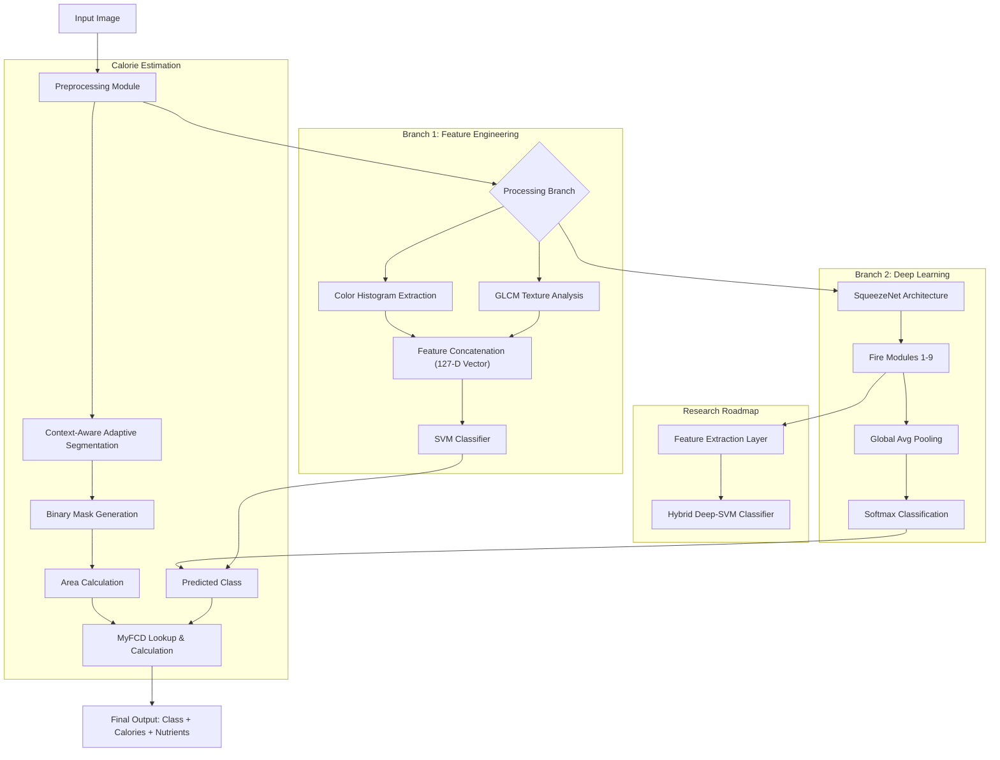
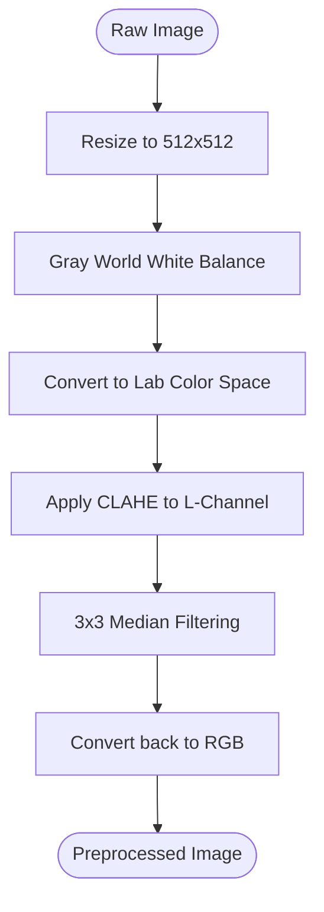
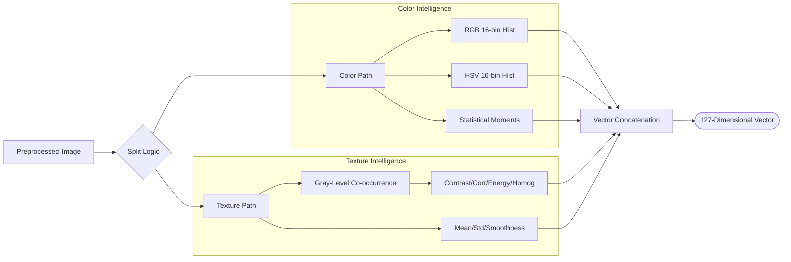
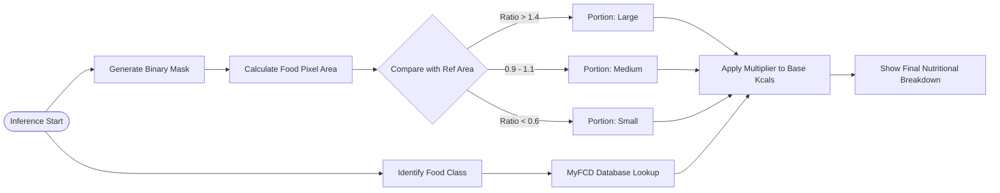

# CHAPTER 3: METHODOLOGY

The methodology used in this project employs the most sophisticated computer vision pipeline to date that has been created for the dual purpose of identifying and tackling the issues of highly diverse and multifarious Malaysian hawker food. The overall operational framework can be delineated into five modules or components: Image Preprocessing, Feature extraction, Classification, Segmentation, and Nutritional Analysis. The whole process starts by standardising the raw input images through colour correction and noise reduction to provide uniformity for images captured at different lighting conditions. After this stage, the system splits into two parallel processing streams. One follows the classical machine learning route and employs hand-crafted features, namely colour histogram and texture, for SVM classification, while the other, a deep learning route based on Transfer Learning SqueezeNet model, aims for high-level classification/recognition. Simultaneously, a "context-aware" segmentation engine isolates the food entity so that accurate portion size estimation can be performed. The combination of these multiple approaches guarantees that the system can not only identify the food item with high confidence but also estimate, in a more verifiable and objective manner, the number of calories that the food item contains.

## 3.1 Overall System Flow

The system's modular pipeline design focuses on the streamlining of the identification and nutritional evaluation of foods from Malaysian hawker centers. The first stage is Image Acquisition, whereby an end user submits an unprocessed image into the system through either a file upload or through a live camera. The image is immediately forwarded to the Preprocessing Module, from where it is standardized through resizing to a 512 by 512 pixel dimension and is subjected to further lighting adjustments. The image flow then splits into two classification branches, one a classical machine learning path and the other a deep learning path. The classical path features an SVM classifier and an image feature extraction through hand-crafted color and texture feature engineering. The deep learning path also processes the image through a SqueezeNet CNN. While this image classification is happening, the preprocessed image is directed to the Segmentation Engine, which creates a binary mask isolating the food and background. The last stage is Calorie Estimation, where the output food class of the two classification branches and the segmentation mask to estimate portion size are cross-referenced with the MyFCD database. This process computes and returns the user a total of the calories and macronutrients as seen in Figure 3.1.

**Figure 3.1: System Flow**

## 3.2 Dataset / Image Source

The project utilizes a subset of the Malaysia Food 11 dataset from Kaggle, originally containing approximately 7,000 images across 7 classes of authentic Malaysian hawker food. These classes include Nasi Lemak, Roti Canai, Satay, Laksa, Popiah, Kaya Toast, and Mixed Rice. Items such as hamburger, fish and chips, fried rice, and fried noodles were excluded to maintain focus specifically on local hawker cuisine. The images capture real-world variations in presentation, lighting, and composition essential for testing system robustness.

A data quality assurance process was performed to identify and remove corrupted or low-quality images that could negatively impact model training. This cleaning process removed 58 unusable images, resulting in a final dataset of 6,924 high-quality images. The dataset was then split 80/20 into training and testing sets, allocating 5,542 images for training and 1,382 images for testing. This split was done through stratified sampling to maintain class balance across both sets. The dataset is organized in a hierarchical folder structure which is compatible for direct ingestion by MATLAB imageDatastore and imageLabeler apps, providing seamless training and verification.

## 3.3 Image Processing Techniques Used

This section details the core image processing pipeline employed by the system. The techniques are organized sequentially according to the processing flow: starting with preprocessing and data augmentation to standardize inputs, followed by feature extraction to create numerical representations, then classification using both traditional and deep learning approaches, segmentation to isolate food regions, and finally portion estimation with calorie calculation. Each stage builds upon the previous to ensure accurate food recognition and reliable nutritional analysis.

### 3.3.1 Preprocessing and Data Augmentation

To standardize inputs and eliminate external noise, the preprocessing pipeline uses several techniques. The system implements Gray World White Balance (Buchsbaum, 1980) which adjusts color biases caused by factors such as yellowish indoor lighting by computing the mean to balance the channels R, G, and B. After that, Contrast Limited Adaptive Histogram Equalization, known as CLAHE (Zuiderveld, 1994), is applied to the L channel of the Lab color space. This increases the clarity on a local level without losing control on noise. Finally, a 3 by 3 Median Filter is used to eliminate noise while keeping edge details.

To cope with overfitting and to effectively increase the training dataset, techniques for Data Augmentation were used. As seen in Figure 3.2, the training set was increased three times using random geometric transformations, including rotation of plus or minus 20 degrees, scaling between 0.9 and 1.1, and horizontal flipping. This ensures that the model learns to identify food items irrespective of the orientation or size in the frame.

**Figure 3.2: Preprocessing and Data Augmentation Flowchart**

### 3.3.2 Feature Extraction: Color Histograms and GLCM Texture

In the classical machine learning branch, the system constructs and extracts a resilient 127-dimensional feature vector to characterize each image. Color Histograms are constructed in each of the RGB and HSV color spaces using 16 histogram bins for each channel, leading to the global color distribution description which is essential for food color identification. Five color moment statistics, including mean, standard deviation, skewness, and kurtosis, are calculated to summarize the intensity and variation of a color.

In the case of food items in which structural differences are present despite the same color, the system employs texture analysis using Gray-Level Co-occurrence Matrices, often abbreviated as GLCM (Haralick et al., 1973). The GLCM is computed by counting the occurrences of pixel intensity pairs at a specified offset. As seen in Figure 3.3, the system analyzes the four texture properties of Contrast, Correlation, Energy, and Homogeneity in each of four orientations at 0, 45, 90, and 135 degrees to give an exhaustive analysis while retaining a degree of rotation invariance. The Contrast property, for example, is calculated as:

$$\text{Contrast} = \sum_{i,j} |i - j|^2 \cdot P(i,j)$$

where P(i,j) represents the normalized GLCM value at position (i,j). The texture of rice is complex and grainy while some other foods, such as soups, are smooth.

**Figure 3.3: Feature Extraction Flow**

### 3.3.3 Classification: SVM and CNN

The system uses two different classification methods. The first is multiclass Support Vector Machine, or SVM (Cortes & Vapnik, 1995), classifying methods under the Error-Correcting Output Codes framework with One-vs-One coding. The Radial Basis Function kernel was chosen because it provides the best separation for non-linear food data. The model is validated using 5-fold cross-validation, achieving a cross-validation accuracy of 79.56%. Final test set performance is reported in Chapter 5.

The second model uses Deep Learning and Transfer Learning with the SqueezeNet architecture (Iandola et al., 2016). SqueezeNet was specifically chosen for its lightweight design, offering AlexNet-level accuracy while having 50 times fewer parameters. This compact architecture makes the model suitable for future deployment on mobile devices, where computational resources and memory are limited, enabling real-time food analysis at hawker centers. The pre-trained network was adjusted by replacing the last convolutional layer, conv10, to output class probabilities for the seven food classes. Trained using Stochastic Gradient Descent with Momentum for 10 epochs, this model achieves a test accuracy of 83.00% and serves as the main engine for the final application.

### 3.3.4 Segmentation: HSV Thresholding, Morphology, and Chan-Vese

The segmentation module uses a state-of-the-art adaptive pipeline known as Context-Aware segmentation. The module starts with Geometry-Aware HSV Thresholding where an initial rough mask is created based on color and intensity pertaining to the predicted food class. This is followed by Morphological Operations where cleaning steps of dilation and erosion remove background noise and fill small gaps in the object.

To achieve seamless segmentation, the system uses the refined level sets of the Chan-Vese Active Contours (Chan & Vese, 2001). This iterative algorithm tracks the object boundary by adjusting the curve to the boundary through energy minimization. The Chan-Vese model minimizes the following energy functional:

$$E(C) = \mu \cdot \text{Length}(C) + \lambda_1 \int_{\text{inside}(C)} |I(x,y) - c_1|^2 \, dx\,dy + \lambda_2 \int_{\text{outside}(C)} |I(x,y) - c_2|^2 \, dx\,dy$$

where C is the contour, I(x,y) is the image intensity, and c1 and c2 are the mean intensities inside and outside the contour respectively. This formulation allows the algorithm to wrap around food items even when gradients are not sharp. Additional layers of sophistication include table killing to remove background furniture and smart polishing to ensure the food is perfectly cutout.

### 3.3.5 Portion Estimation and Calorie Calculation

After food is recognized and segmented, the system determines the portion ratio by evaluating the pixel size of the food mask against a reference area calibrated to a standard 25cm plate. This ratio is then used to categorize the portion size into specific tiers. According to the system logic, a ratio below 0.6 is categorized as Small, a ratio between 0.9 and 1.1 is Medium, and a ratio above 1.4 is Large. Intermediate values are handled through granular labels such as Medium-Small or Medium-Large to maintain precision.

Final calorie calculations integrate these results with the Malaysian Food Composition Database, or MyFCD. The system retrieves the base calorie value along with the macronutrient composition including Protein, Carbs, and Fat, then adjusts these values according to the portion ratio. This offers a personalized and flexible nutritional assessment as opposed to a simple lookup. The flow of the calculation can be seen in Figure 3.4.

**Figure 3.4: Calorie Logic Flowchart**

### 3.3.6 Summary of Image Processing Techniques

Table 3.1 provides a consolidated overview of all image processing techniques employed in the system, mapping each pipeline stage to its corresponding method and output.

**Table 3.1: Summary of Image Processing Techniques**

| Stage | Technique | Output |
|:------|:----------|:-------|
| Preprocessing | Gray World White Balance, CLAHE, 3x3 Median Filter | 512x512 normalized RGB image |
| Feature Extraction | RGB and HSV 16-bin Histograms, GLCM Texture Properties | 127-dimensional feature vector |
| Classification | SVM with ECOC and RBF kernel, or SqueezeNet CNN | Food class label with confidence |
| Segmentation | HSV Thresholding, Morphological Operations, Chan-Vese Active Contours | Binary food mask |
| Calorie Estimation | Portion ratio calculation with MyFCD database lookup | Calories and macronutrients |

## 3.4 Tools and Software

The entire project was developed using MATLAB R2025b, leveraging its comprehensive ecosystem for scientific computing. MATLAB was selected for its robust support for image processing, machine learning, and deep learning workflows, along with its integrated development environment that facilitates rapid prototyping and testing. Table 3.2 summarizes the key toolboxes and their specific roles within the system.

**Table 3.2: MATLAB Toolboxes and Functions**

| Toolbox | Primary Functions | System Module |
|:--------|:------------------|:--------------|
| Image Processing Toolbox | imresize, adapthisteq, medfilt2, activecontour, bwmorph | Preprocessing, Segmentation |
| Computer Vision Toolbox | extractFeatures, graycomatrix, graycoprops | Feature Extraction |
| Statistics and Machine Learning Toolbox | fitcecoc, templateSVM, crossval, predict | SVM Classification |
| Deep Learning Toolbox | squeezenet, trainNetwork, layerGraph, classify | CNN Classification |
| Deep Learning Toolbox Model for SqueezeNet | Pre-trained ImageNet weights | Transfer Learning |

Beyond the core toolboxes, the final user interface was built using MATLAB App Designer, which provides an object-oriented framework for creating standalone GUI applications. App Designer enables the creation of professional interfaces with callback-driven event handling, allowing users to load images, select classification modes, and view results interactively. The compiled application integrates all system components into a single executable package suitable for deployment on Windows, macOS, and Linux environments.

## 3.5 Hardware Requirements

To ensure efficient processing and model training, the system was developed and tested on a high-performance computing environment. The hardware configuration includes an Intel Core i7 processor and 16 GB of DDR4 RAM to handle the intensive image processing and machine learning workflows. A dedicated NVIDIA GPU with CUDA support was utilized to accelerate the deep learning training phases, significantly reducing the time required for the SqueezeNet fine-tuning process. Storage requirements were met using a 500 GB Solid State Drive to ensure rapid data access during the training and validation cycles using the Malaysia Food 11 dataset.

## 3.6 Conclusion

This chapter has provided a comprehensive overview of the methodology employed to develop the Malaysian Hawker Food Recognition and Calorie Estimation System. By integrating both classical machine learning and modern deep learning techniques, the system achieves a robust balance between interpretability and performance. The inclusion of a context-aware segmentation engine ensures that portion size, and by extension calorie estimation, is calculated with high precision. The technical framework established in this chapter serves as the foundation for the implementation details and experimental results presented in the subsequent chapters.
