# CHAPTER 4: IMPLEMENTATION

This chapter details the technical realization of the Malaysian Hawker Food Calorie Estimation System. It elucidates the algorithmic design, code structure, and parameter configurations that govern the system's operation. The implementation bridges theoretical concepts with practical application using MATLAB, ensuring robust performance across varying real-world conditions.

## 4.1 Algorithm Design

The system architecture is engineered to support a dual-mode classification approach, allowing users to select between a classical Support Vector Machine (SVM) pipeline and a Deep Learning (CNN) pipeline. This flexibility is managed by the central orchestration script, `analyzeHawkerFood.m`, which directs the data flow based on the selected mode while maintaining a unified preprocessing and segmentation strategy.

### 4.1.1 SVM Pipeline

The classical machine learning pipeline, initialized by setting the mode to 'svm', relies on the extraction of handcrafted features to distinguish between food classes. The process begins with image acquisition, followed by a preprocessing stage where the image is resized and subjected to histogram stretching to normalize contrast. This ensures that lighting variations do not adversely affect the feature extraction process. **Figure 4.1 demonstrates the visual effect of the preprocessing stage, showing how histogram stretching enhances contrast and normalizes the input image for subsequent feature extraction.**

**Figure 4.1: Preprocessing Effect Comparison**

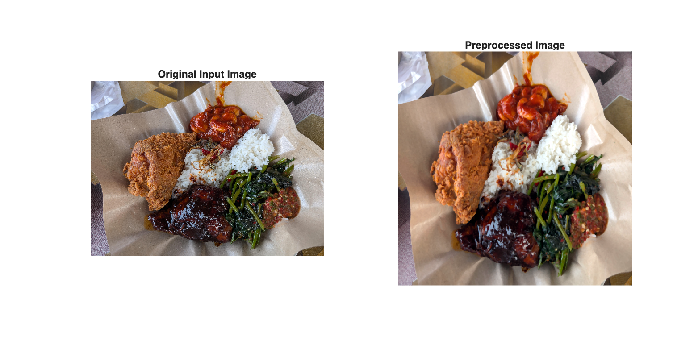

Following preprocessing, the system extracts a precise set of features responsible for capturing the visual characteristics of the food. Color attributes are quantified using the Hue-Saturation-Value (HSV) color space, where statistical moments such as mean and standard deviation are computed for each channel. Simultaneously, the Gray-Level Co-occurrence Matrix (GLCM) is utilized to analyze texture. Contrast, correlation, energy, and homogeneity are derived from the GLCM of the grayscale image to represent the surface details of dishes. These features are concatenated into a single feature vector that serves as the input for the trained Error-Correcting Output Codes (ECOC) SVM classifier. Table 4.1 summarizes this feature extraction process, mapping the raw visual input to the mathematical descriptors used by the SVM.

**Table 4.1: Feature Extraction Process**

| Step | Description | Visualization |
|:---:|:---|:---:|
| 1 | **Original Image**: The raw input image of Malaysian hawker food. |  |
| 2 | **Texture Analysis**: Extraction of GLCM properties: Contrast, Correlation, Energy, and Homogeneity from the grayscale image. | *Refer to Figure 4.2* |
| 3 | **Feature Vector Formation**: Combination of 108 Color features and 19 Texture features. | *Refer to Figure 4.3* |

Figure 4.2 below visualizes the specific texture properties extracted via the GLCM method, highlighting the contrast and energy metrics that help distinguish food surfaces.

**Figure 4.2: GLCM Texture Properties**

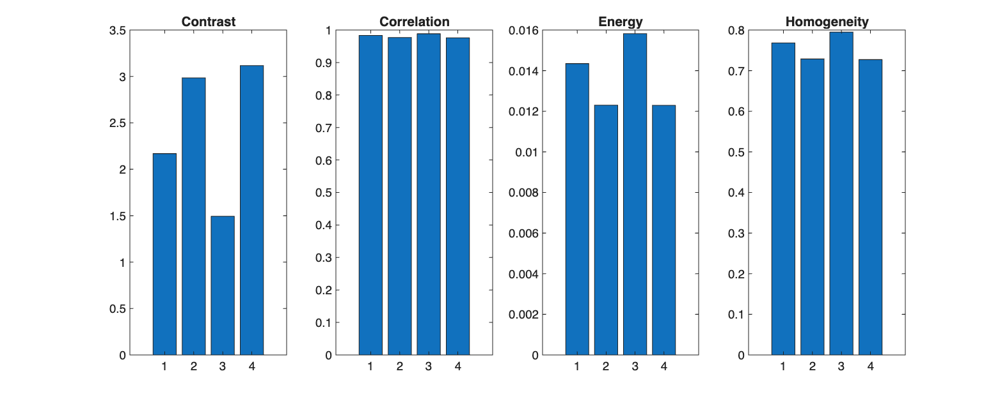

As shown in Figure 4.3 below, the resulting feature vector represents a distinct signature for each food item. The bar chart illustrates the magnitude of different feature components, highlighting the dominance of specific color or texture attributes that enable the SVM to separate classes effectively.

**Figure 4.3: Extracted Feature Vector Visualization**

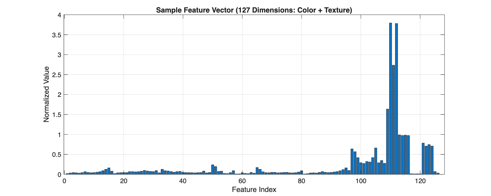

### 4.1.2 CNN Pipeline

The Deep Learning pipeline, activated by the 'cnn' mode, leverages the SqueezeNet architecture for end-to-end feature learning and classification. This approach bypasses manual feature extraction, instead allowing the network to learn hierarchical representations directly from the raw pixel data. The pipeline loads the pre-trained SqueezeNet model, which has been fine-tuned on the Malaysian hawker food dataset using transfer learning. The input image is resized to match the network input layer requirements and normalized using the mean and standard deviation of the training set.

Figure 4.4 depicts the architecture of the SqueezeNet model used in this pipeline. The network consists of a series of Fire modules that compress and expand the feature maps, allowing for deep learning performance with significantly fewer parameters than traditional architectures like AlexNet. This efficiency makes it particularly suitable for the project goal of a lightweight yet accurate recognition system.

**Figure 4.4: SqueezeNet Architecture**

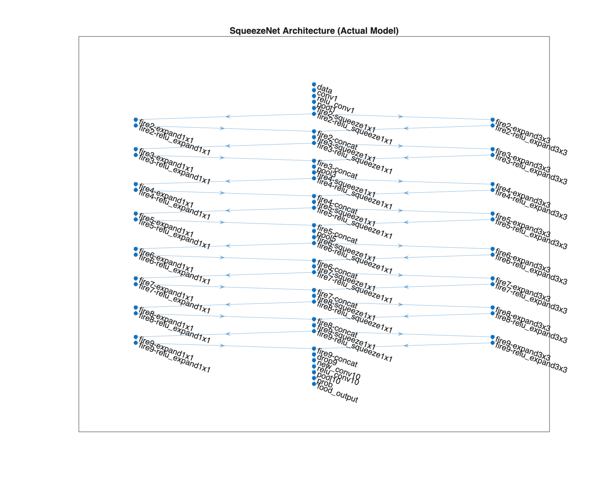

Figure 4.5 illustrates the complete CNN training lifecycle, from dataset preparation through augmentation, network modification, and final evaluation.

**Figure 4.5: CNN Training Lifecycle**

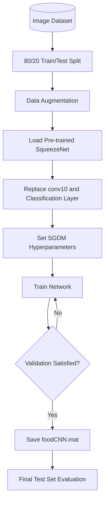

Once the classification is complete via either SVM or CNN, the system proceeds to the critical stage of segmentation for portion estimation. The segmentation algorithm, implemented in `segmentFood.m`, employs a sophisticated multi-step pipeline. The process begins with adaptive histogram equalization using the LAB color space to enhance local contrast. This is followed by HSV color thresholding using the `hsvThreshold.m` function, which applies food-specific saturation and value ranges to isolate food pixels from plate and background regions. The initial mask is then refined through morphological cleaning in `morphologyClean.m`, which applies opening to remove small noise, closing to fill gaps, hole filling, and area-based filtering. For dishes with mixed components, k-means clustering is applied to separate different food regions. Finally, the Chan-Vese active contour model refines the boundary by iteratively minimizing the energy function to achieve a smooth, accurate delineation of the food region.

Table 4.2 visualizes a conceptual segmentation workflow that demonstrates the general principles of morphological processing. The figures illustrate the progression from edge detection through dilation, hole filling, erosion, and final segmentation overlay. This representation provides a clear educational visualization of how binary masks are progressively refined to achieve accurate food region detection.

**Table 4.2: Segmentation Evolution via Morphological Processing**

| Step | Description | Visualization |
|:---:|:---|:---:|
| 1 | **Original Image**: The preprocessed input image ready for segmentation. |  |
| 2 | **Edge Detection**: Initial gradient-based edge detection to identify boundaries. |  |
| 3 | **Dilated Mask**: Morphological dilation to connect disjoint edge regions. | 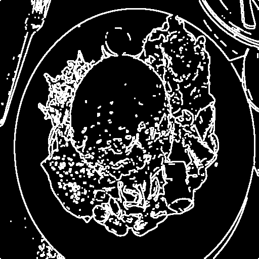 |
| 4 | **Filled and Cleared**: Hole filling and border clearing operations. | 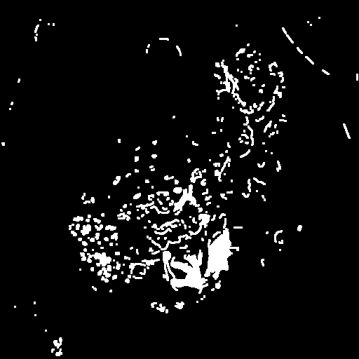 |
| 5 | **Cleaned Mask**: Morphological erosion and small region removal to reduce noise. | 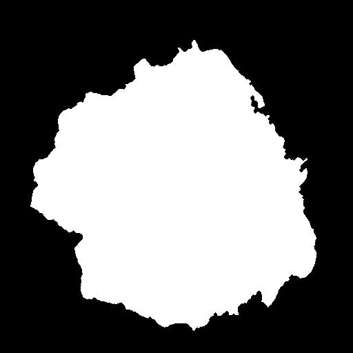 |
| 6 | **Final Segmented**: The refined mask is applied as a green contour overlay on the original image. | 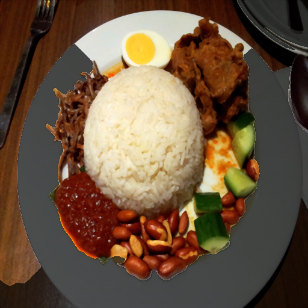 |

To further verify the advanced capability of the system, Figure 4.6 displays the actual iteration evolution of the Chan-Vese Active Contour model. The shrink-wrapping effect is clearly visible as the contour tightens around the food object, ensuring precise boundary detection even for irregular shapes.

**Figure 4.6: Chan-Vese Active Contour Evolution**

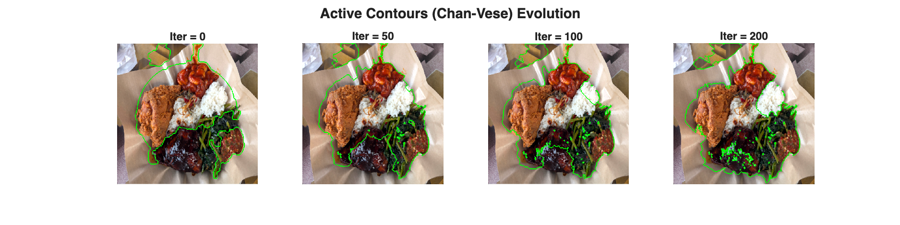

**For multi-component dishes such as mixed rice, the system employs K-means clustering to separate distinct food regions before applying the active contour refinement. Figure 4.7 visualizes the K-means segmentation logic, demonstrating how five clusters effectively partition the image into semantically meaningful food regions based on color similarity.**

**Figure 4.7: K-Means Color Clustering for Multi-Component Dishes**

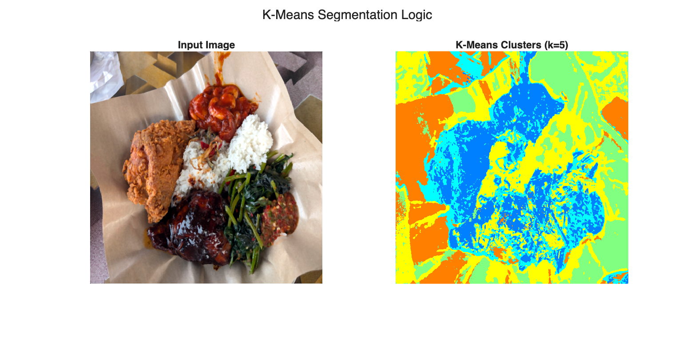

Figure 4.8 illustrates the complete Context-Aware Segmentation pipeline, showing how different food classes trigger specialized processing paths. This adaptive approach ensures optimal mask quality for each food type.

**Figure 4.8: Context-Aware Segmentation Pipeline**

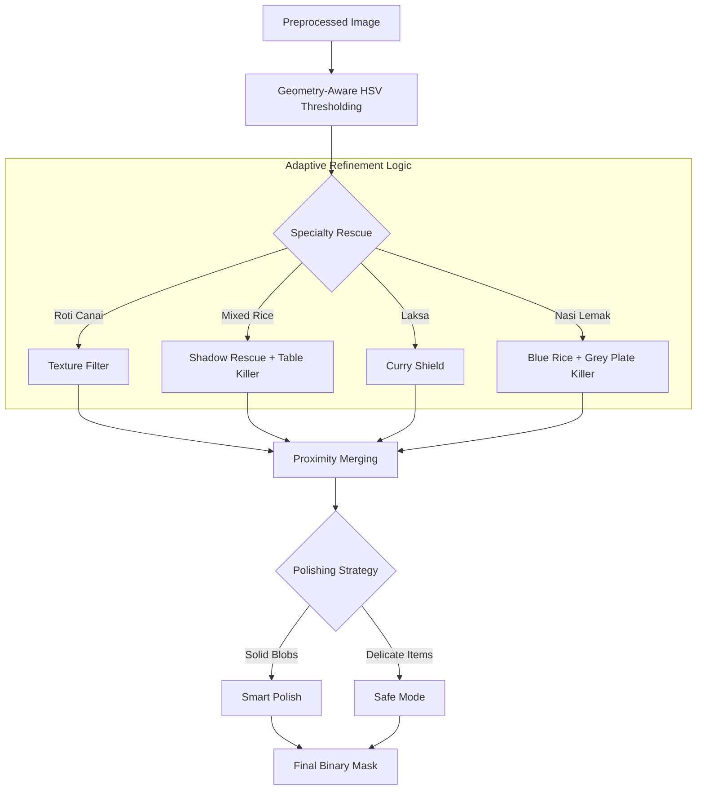

## 4.2 Code Structure

The system is organized into a modular architecture that separates concerns across distinct functional units. This design philosophy ensures maintainability, facilitates unit testing, and allows for independent updates to individual components without disrupting the overall system. The codebase is structured around four primary modules: the Graphical User Interface, the training scripts, and a collection of specialized helper functions.

### 4.2.1 GUI Module

The graphical user interface is implemented in `HawkerFoodCalorieApp.m`, located within the `gui` module. This is a MATLAB App Designer application built using the object-oriented `classdef` paradigm. The application extends the standard `matlab.apps.AppBase` class, inheriting the necessary lifecycle methods for app initialization and cleanup. The interface is designed with a premium aesthetic featuring a carefully curated color palette including Apple Blue for primary actions, Emerald Green for success states, and Amber for highlights.

Figure 4.9 presents the core structure of the GUI class, demonstrating the property declarations that define the user interface components. The application maintains separate properties for the main layout grid, image display axes, control buttons, and nutrition display panels.

**Figure 4.9: GUI Class Properties Definition**

```matlab
classdef HawkerFoodCalorieApp < matlab.apps.AppBase

    % Premium Malaysian Hawker Food Recognition GUI
    % Modern UI/UX with beautiful design and smooth interactions
    
    properties (Access = public)
        UIFigure                   matlab.ui.Figure
        
        % Main Layout
        MainGrid                   matlab.ui.container.GridLayout
        
        % Left Side - Images
        ImagePanel                 matlab.ui.container.Panel
        OriginalAxes               matlab.ui.control.UIAxes
        ProcessedAxes              matlab.ui.control.UIAxes
        SegmentedAxes              matlab.ui.control.UIAxes
        
        % Right Side - Controls & Results
        ControlPanel               matlab.ui.container.Panel
        LoadButton                 matlab.ui.control.Button
        AnalyzeButton              matlab.ui.control.Button
        ClassifierDropdown         matlab.ui.control.DropDown
        
        % Nutrition Card
        NutritionPanel             matlab.ui.container.Panel
        CaloriesValueLabel         matlab.ui.control.Label
        ProteinLabel               matlab.ui.control.Label
        CarbsLabel                 matlab.ui.control.Label
        FatLabel                   matlab.ui.control.Label
    end
```

The GUI implements dual-mode analysis, allowing users to select between SVM and CNN classification via a dropdown control. Figure 4.10 illustrates the analysis callback function that routes the input image to the appropriate pipeline based on user selection.

**Figure 4.10: Dual-Mode Analysis Logic**

```matlab
function AnalyzeButtonPushed(app, ~, ~)
    if isempty(app.CurrentImage)
        return;
    end
    
    % Disable buttons during processing
    app.AnalyzeButton.Enable = 'off';
    app.LoadButton.Enable = 'off';
    
    if app.UseDeepLearning
        app.updateStatus('⏳ Analyzing with CNN (Deep Learning)...', app.DLColor);
    else
        app.updateStatus('⏳ Analyzing with SVM (Classical)...', app.AccentColor);
    end
    drawnow;
    
    try
        % Run analysis
        tic;
        if app.UseDeepLearning
            results = analyzeHawkerFoodDL(app.CurrentImage);
        else
            results = analyzeHawkerFood(app.CurrentImage);
        end
        processingTime = toc;
        app.CurrentResults = results;
        
        % Display processed image
        cla(app.ProcessedAxes);
        imshow(results.processedImage, 'Parent', app.ProcessedAxes);
```

### 4.2.2 Training Scripts

The system includes two primary training scripts that generate the classification models used during inference. The first, `trainClassifier.m`, implements the SVM training pipeline with 5-fold cross-validation. Figure 4.11 shows the feature extraction loop that processes each food class, applying preprocessing and extracting the 127-dimensional feature vector for each image.

**Figure 4.11: SVM Feature Extraction Loop**

```matlab
for c = 1:numClasses
    className = classNames{c};
    classPath = fullfile(datasetPath, className);
    
    fprintf('[%d/%d] Processing: %s\n', c, numClasses, className);
    
    % Get image files
    imageFiles = [dir(fullfile(classPath, '*.jpg')); 
                  dir(fullfile(classPath, '*.png'));
                  dir(fullfile(classPath, '*.jpeg'))];
    numImages = min(length(imageFiles), maxImagesPerClass);
    
    for i = 1:numImages
        try
            imagePath = fullfile(classPath, imageFiles(i).name);
            
            % Load and preprocess image
            img = imread(imagePath);
            processedImg = preprocessImage(img);
            
            % Extract features (127-dimensional vector)
            colorFeatures = extractColorFeatures(im2double(processedImg));
            textureFeatures = extractTextureFeatures(rgb2gray(processedImg));
            
            features = [colorFeatures, textureFeatures];
```

The SVM classifier is trained using the Error-Correcting Output Codes (ECOC) framework with a Radial Basis Function (RBF) kernel. Figure 4.12 demonstrates the cross-validation and final model training process.

**Figure 4.12: SVM Cross-Validation and Training**

```matlab
%% Cross-Validation (5-Fold)
numFolds = 5;
cv = cvpartition(allLabels, 'KFold', numFolds);

cvAccuracies = zeros(numFolds, 1);

for fold = 1:numFolds
    fprintf('Fold %d/%d: ', fold, numFolds);
    
    % Split data
    trainIdx = cv.training(fold);
    testIdx = cv.test(fold);
    
    XTrain = normalizedFeatures(trainIdx, :);
    YTrain = allLabels(trainIdx);
    XTest = normalizedFeatures(testIdx, :);
    YTest = allLabels(testIdx);
    
    % Train SVM with optimized parameters
    svmTemplate = templateSVM('KernelFunction', 'rbf', ...
                              'KernelScale', 'auto', ...
                              'BoxConstraint', 10, ...
                              'Standardize', false);
    
    cvClassifier = fitcecoc(XTrain, yTrain, ...
                            'Learners', svmTemplate, ...
                            'Coding', 'onevsall');
    
    % Evaluate
    predictions = predict(cvClassifier, XTest);
    cvAccuracies(fold) = sum(strcmp(predictions, yTest)) / length(yTest);
end
```

The second training script, `train_squeezenet.m`, implements the CNN pipeline using transfer learning with the SqueezeNet architecture. Figure 4.13 shows the network modification process where the final convolutional layer is replaced to accommodate the seven food classes.

**Figure 4.13: SqueezeNet Network Modification**

```matlab
%% Load Pre-trained Network
fprintf('Loading pre-trained SqueezeNet...\n');
net = squeezenet;

inputSize = net.Layers(1).InputSize;
fprintf('Input size: %d x %d x %d\n\n', inputSize(1), inputSize(2), inputSize(3));

%% Network Modification
numClasses = numel(categories(imdsTrain.Labels));
lgraph = layerGraph(net);

% SqueezeNet uses a 1x1 convolution (conv10) followed by pooling.
% Replace 'conv10' with a new 1x1 convolution for our number of classes.

newConvLayer = convolution2dLayer([1 1], numClasses, ...
    'Name', 'new_conv10', ...
    'WeightLearnRateFactor', 10, ...
    'BiasLearnRateFactor', 10);

lgraph = replaceLayer(lgraph, 'conv10', newConvLayer);

% Replace classification layer
newClassLayer = classificationLayer('Name', 'food_output');
lgraph = replaceLayer(lgraph, 'ClassificationLayer_predictions', newClassLayer);
```

### 4.2.3 Helper Functions

The system relies on a collection of specialized helper functions organized into subdirectories by functionality. The preprocessing module, encapsulated in `preprocessImage.m`, applies a standardized pipeline to all input images. Figure 4.14 illustrates the five-step preprocessing sequence.

**Figure 4.14: Preprocessing Pipeline**

```matlab
function [processedImg, originalSize] = preprocessImage(img, targetSize)
    %% Input validation
    if nargin < 2
        targetSize = [512, 512];  % Default target size
    end
    
    % Store original size
    originalSize = [size(img, 1), size(img, 2)];
    
    %% Step 1: Resize image to target dimensions
    resizedImg = imresize(img, targetSize);
    
    %% Step 2: Convert to double for processing
    doubleImg = im2double(resizedImg);
    
    %% Step 3: Apply histogram stretching
    stretchedImg = histogramStretch(doubleImg);
    
    %% Step 4: Apply noise reduction
    filteredImg = noiseFilter(stretchedImg, 'median', 3);
    
    %% Step 5: Convert back to uint8
    processedImg = im2uint8(filteredImg);
end
```

The feature extraction module, `extractColorFeatures.m`, generates a 108-dimensional color feature vector combining RGB and HSV histogram statistics. Figure 4.15 shows the histogram computation process.

**Figure 4.15: Color Feature Extraction**

```matlab
function [colorFeatures, featureNames] = extractColorFeatures(img)
    %% Parameters
    numBins = 16;  % Number of histogram bins
    
    %% Ensure image is double
    if isa(img, 'uint8')
        img = im2double(img);
    end
    
    %% RGB Histogram Features
    rgbHist = zeros(1, numBins * 3);
    for c = 1:3
        channel = img(:,:,c);
        hist = imhist(channel, numBins);
        hist = hist / sum(hist);  % Normalize
        rgbHist((c-1)*numBins + 1 : c*numBins) = hist';
    end
    
    %% HSV Histogram Features
    hsvImg = rgb2hsv(img);
    hsvHist = zeros(1, numBins * 3);
    for c = 1:3
        channel = hsvImg(:,:,c);
        hist = imhist(channel, numBins);
        hist = hist / sum(hist);  % Normalize
        hsvHist((c-1)*numBins + 1 : c*numBins) = hist';
    end
    
    %% Combine all color features (108 total)
    colorFeatures = [rgbHist, hsvHist, rgbStats, hsvStats];
end
```

The calorie calculation module, `calculateCalories.m`, queries the Malaysian Food Composition Database and adjusts nutritional values based on detected portion size. Figure 4.16 demonstrates this calculation process.

**Figure 4.16: Portion-Adjusted Calorie Calculation**

```matlab
function [calories, nutrition] = calculateCalories(foodClass, portionRatio)
    %% Input validation
    if nargin < 2
        portionRatio = 1.0;
    end
    
    % Ensure valid portion ratio
    portionRatio = max(0.1, min(2.5, portionRatio));
    
    %% Get base nutritional values from MyFCD
    foodInfo = foodDatabase(foodClass);
    
    %% Calculate portion-adjusted values
    calories = round(foodInfo.baseCalories * portionRatio);
    
    if nargout > 1
        nutrition = struct();
        nutrition.foodClass = foodClass;
        nutrition.displayName = foodInfo.displayName;
        nutrition.description = foodInfo.description;
        nutrition.referenceServing = foodInfo.referenceServing;
        nutrition.portionRatio = portionRatio;
        nutrition.calories = calories;
        nutrition.protein = round(foodInfo.protein * portionRatio, 1);
        nutrition.carbs = round(foodInfo.carbs * portionRatio, 1);
        nutrition.fat = round(foodInfo.fat * portionRatio, 1);
        
        % Calculate percentage of daily values based on 2000 kcal diet
        nutrition.caloriesDV = round(calories / 2000 * 100);
        nutrition.proteinDV = round(nutrition.protein / 50 * 100);
        nutrition.carbsDV = round(nutrition.carbs / 300 * 100);
        nutrition.fatDV = round(nutrition.fat / 65 * 100);
    end
end
```


## 4.3 Parameter Settings

This section documents the critical hyperparameters and configuration values used throughout the system. These parameters were selected through empirical testing and optimization to balance accuracy, performance, and computational efficiency.

### 4.3.1 Preprocessing Parameters

The preprocessing module applies a standardized transformation pipeline to all input images. Table 4.3 summarizes the key parameters used in the `preprocessImage.m` function.

**Table 4.3: Preprocessing Configuration Parameters**

| Parameter | Value | Purpose |
|:---|:---:|:---|
| Target Size | 512 x 512 | Standardizes input dimensions for consistent feature extraction |
| Histogram Bins | 256 | Number of intensity levels for histogram stretching |
| Median Filter Kernel | 3 x 3 | Removes salt-and-pepper noise while preserving edges |
| Color Space | RGB | Primary color representation for processing |

### 4.3.2 Feature Extraction Parameters

The feature extraction module generates the 127-dimensional feature vector used by the SVM classifier. Table 4.4 details the configuration for both color and texture feature extraction.

**Table 4.4: Feature Extraction Configuration**

| Feature Type | Parameter | Value | Total Dimensions |
|:---|:---|:---:|:---:|
| RGB Histogram | Bins per Channel | 16 | 48 |
| HSV Histogram | Bins per Channel | 16 | 48 |
| Color Statistics | Mean and Standard Deviation | Per Channel | 12 |
| GLCM Texture | Properties | Contrast, Correlation, Energy, Homogeneity | 16 |
| Global Texture | Metrics | Mean, Standard Deviation, Smoothness | 3 |
| **Total** | | | **127** |

### 4.3.3 Segmentation Parameters

The segmentation module employs the Chan-Vese active contour algorithm with specific parameters tuned for food region detection. Table 4.5 presents the segmentation configuration.

**Table 4.5: Segmentation Algorithm Parameters**

| Parameter | Value | Purpose |
|:---|:---:|:---|
| Active Contour Method | Chan-Vese and Edge | Two-stage level-set segmentation |
| Chan-Vese Iterations | 60 | Initial contour evolution steps |
| Edge Iterations | 80 | Boundary refinement steps |
| Contraction Bias | -0.02 | Slight expansion to avoid over-shrinking |
| Morphological SE Size | 5 x 5 | Structuring element for cleanup operations |

### 4.3.4 SVM Classifier Parameters

The Support Vector Machine classifier uses the Error-Correcting Output Codes framework with a Radial Basis Function kernel. Table 4.6 documents the training configuration.

**Table 4.6: SVM Training Configuration**

| Parameter | Value | Purpose |
|:---|:---:|:---|
| Framework | ECOC | Multi-class classification strategy |
| Kernel Function | RBF | Gaussian kernel for non-linear separation |
| Box Constraint | 10 | Regularization parameter |
| Kernel Scale | Auto | Automatically determined by MATLAB |
| Cross-Validation Folds | 5 | K-fold validation for model evaluation |
| Standardization | External | Features pre-normalized before SVM training |

### 4.3.5 CNN Training Parameters

The SqueezeNet model is fine-tuned using transfer learning with the Stochastic Gradient Descent with Momentum optimizer. Table 4.7 presents the deep learning training configuration.

**Table 4.7: CNN Training Configuration**

| Parameter | Value | Purpose |
|:---|:---:|:---|
| Base Architecture | SqueezeNet | Pre-trained ImageNet model |
| Input Size | 227 x 227 x 3 | Network input dimensions |
| Optimizer | SGDM | Stochastic Gradient Descent with Momentum |
| Initial Learning Rate | 0.0003 | Conservative rate for fine-tuning |
| Learning Rate Schedule | Piecewise | Drop by 0.1 every 5 epochs |
| Mini-Batch Size | 32 | Samples per gradient update |
| Maximum Epochs | 10 | Total training iterations |
| Validation Frequency | 50 | Iterations between validation checks |
| Data Augmentation | Random Rotation and Horizontal Flip | Range of -20 to +20 degrees |

### 4.3.6 Calorie Estimation Parameters

The calorie calculation module uses portion ratios to adjust nutritional values from the Malaysian Food Composition Database. Table 4.8 summarizes the estimation parameters.

**Table 4.8: Calorie Estimation Configuration**

| Parameter | Value | Purpose |
|:---|:---:|:---|
| Reference Database | MyFCD | Malaysian Food Composition Database |
| Portion Ratio Range | 0.1 to 2.5 | Valid multiplier bounds |
| Daily Value Baseline | 2000 kcal | Standard caloric intake reference |
| Protein RDA | 50 g | Recommended Daily Allowance |
| Carbohydrates RDA | 300 g | Recommended Daily Allowance |
| Fat RDA | 65 g | Recommended Daily Allowance |

These parameter configurations represent the final optimized settings used in the production system. Each value was determined through systematic testing to achieve the best balance between classification accuracy and computational performance.
