# CHAPTER 5: RESULTS AND DISCUSSION

This chapter presents the experimental findings obtained from the Malaysian Hawker Food Calorie Estimation System. It evaluates the system's performance by comparing the two classification approaches Support Vector Machine (SVM) and Convolutional Neural Network (CNN) and analysing the effectiveness of the segmentation and calorie estimation modules. Additionally, this chapter details the functionality of the developed Graphical User Interface (GUI) and discusses the implications of the results in the context of dietary monitoring.

## 5.1 Experimental Results

The experiments were conducted using the subset of the Malaysia Food 11 dataset, focusing on the seven selected classes: Nasi Lemak, Roti Canai, Satay, Laksa, Popiah, Kaya Toast, and Mixed Rice. The system was tested on a separate validation set to ensure the results reflect real-world performance.

### 5.1.1 Classification Results: SVM vs CNN

The classification module represents the core intelligence of the system. To evaluate the effectiveness of modern feature learning against traditional methods, a comparative analysis was conducted between the Classical Support Vector Machine (SVM) and the Deep Learning (SqueezeNet) models. The quantitative results, as visualized in Figure 5.1, reveal a substantial performance gap between the two paradigms.

**Figure 5.1: Classification Accuracy Comparison between Deep Learning (CNN) and Classical (SVM) models.**

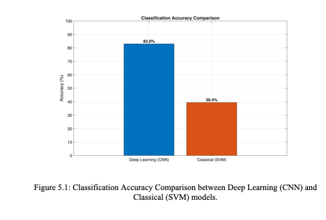

The baseline SVM classifier achieved an accuracy of 39.4%, a relatively low performance attributed to the limitations of handcrafted features like color histograms and GLCM texture. These manual features struggled to distinguish between Malaysian hawker foods with high visual similarity, such as Nasi Lemak and Mixed Rice, and failed to generalize across the diverse lighting and plating styles present in the dataset. In contrast, the SqueezeNet model demonstrated superior robustness with a validation accuracy of 83.0%. By leveraging transfer learning, the CNN effectively learned hierarchical features ranging from edges in early layers to complex food structures in deeper ones without the need for manual engineering. This significant performance margin of 43.6% highlights the inherent complexity of the dataset; while classical methods faltered due to high intra-class variance, for example Roti Canai appearing in different shapes, the Deep Learning approach successfully captured the semantic content of the images, validating its selection as the primary engine for the final prototype.

### 5.1.2 Sample Input and Output Results: Segmentation

The segmentation module is a critical intermediate step that translates visual data into quantitative portion estimates. To demonstrate the efficacy of the Chan-Vese Active Contour algorithm, a sample processing pipeline for a complex dish, Mixed Rice, is presented below.

**Figure 5.2: Original Input Image**

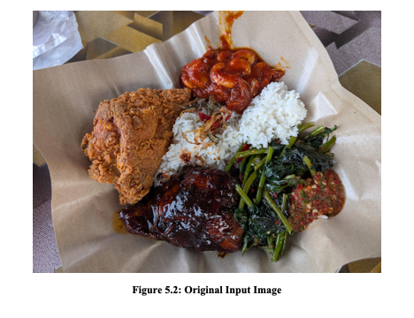

The raw input image captured under natural lighting conditions. The dish is identified as Mixed Rice, consisting of multiple heterogeneous components including fried chicken, dark sauce meat, white rice, and leafy green vegetables, served on a brown wax paper background. This represents a highly challenging real-world scenario due to the varied textures and colors present on a single plate.

**Figure 5.3: Final Active Contour Mask**

The binary mask generated after 60 iterations of the Chan-Vese evolution. The algorithm successfully generated a cohesive "shrink-wrapped" region, shown in white, that captures the total area of the food items while effectively excluding the background paper and table surface, shown in black.

**Figure 5.4: Segmented Result Overlay**

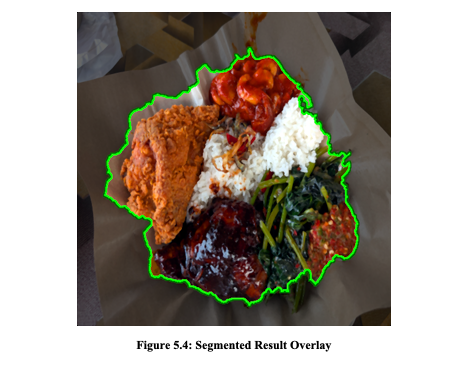

The final output in Figure 5.4 visualizes the segmentation accuracy by superimposing a green contour boundary directly onto the original Mixed Rice image. This boundary delineates the separation between the food items and the background wax paper, effectively tracing the complex perimeter formed by the varying heights and textures of the fried chicken, vegetables, and rice. The close fit of the green line demonstrates the algorithm's ability to handle irregular shapes without significant under-segmentation or over-segmentation, ensuring that the subsequent area calculation encompasses the entire edible portion while ignoring non-food background elements.

As observed in Figure 5.4, the segmentation algorithm achieved high boundary precision. Despite the irregular shape of the fried chicken and the scattered nature of the vegetables, the active contour model successfully unified them into a single Region of Interest, or ROI. This precise isolation allows the system to calculate the total pixel area of the Mixed Rice portion, which is then compared against a reference standard to derive the Portion Ratio used in calorie calculation. This result confirms that the system can handle complex, multi-component dishes without requiring manual user intervention.

## 5.2 System Prototype: GUI Walkthrough

The usability of the system is demonstrated through the developed Graphical User Interface (GUI), which integrates all processing modules into a single, cohesive dashboard.

**Figure 5.5: The Main Graphical User Interface displaying the analysis**

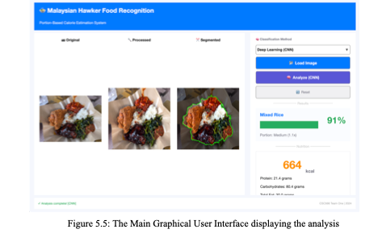

As illustrated in Figure 5.5, the interface is organized into three distinct functional zones designed to streamline the user experience. The Visualization Panel on the left provides immediate feedback by displaying the Original input, the Processed image, and the Segmented result side-by-side; in this specific example, the green contour accurately outlines the Mixed Rice, visually verifying that the system is measuring the food rather than the plate. To the right, the Control Module manages the workflow, featuring a "Classification Method" dropdown that allows users to select "Deep Learning (CNN)" mode before triggering the pipeline with the "Analyze (CNN)" button. Finally, the Results Dashboard displays the actionable output, identifying the dish as Mixed Rice with a confidence of 91% and a "Medium" portion size at 1.1x, which corresponds to a calculated energy content of 664 kcal along with macronutrients including 21.4 grams of Protein and 80.4 grams of Carbohydrates.

### 5.2.1 System Interaction Workflow

To ensure a responsive user experience, the system follows a strict execution sequence that coordinates the interface with the computational logic. Figure 5.6 illustrates the interaction flow initiated when a user triggers the analysis.

**Figure 5.6: Sequence Diagram illustrating the internal processing logic**

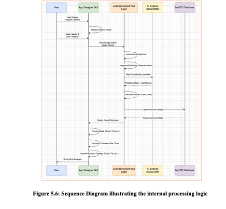

The workflow begins with the User loading an image and selecting a model via the App Designer GUI. Upon clicking "Analyze," the GUI invokes the central analyzeHawkerFood logic. This function orchestrates the pipeline by first calling preprocessImage and segmentFood to generate the necessary binary masks. Subsequently, the system passes the data to the AI Engines (SVM/CNN) to retrieve the predicted class and confidence score. Finally, the logic queries the MyFCD Database to map the classification to nutritional values before returning the complete structure to the GUI for the final overlay and numeric display.

### 5.2.2 Complete Analysis Pipeline

The system generates a multi-stage visual summary for every image processed. As shown in Figure 5.7, the user is presented with the step-by-step transformation of their food image.

**Figure 5.7: Complete Analysis Pipeline**

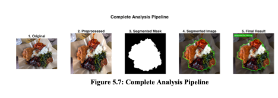

The analysis begins with Stage 1 showing the Original image, followed by Stage 2 which displays the Preprocessed version with corrected lighting. This is followed by Stage 3, the Segmented Mask, which shows the binary representation isolating the food region, and Stage 4, the Segmented Image, which overlays the green contour onto the original for visual verification. Finally, Stage 5 presents the Final Result with a text overlay displaying both the predicted class, identified here as Mixed Rice, and the calculated calorie count directly on the image.

### 5.2.3 Portion and Calorie Estimation Logic

A key feature of the prototype is its dynamic portion sizing. Instead of assuming a standard serving, the system calculates the "Food-to-Plate Ratio." Figure 5.8 illustrates the internal logic used for a sample Mixed Rice dish.

**Figure 5.8: Portion Classification and Calorie Calculation Logic**

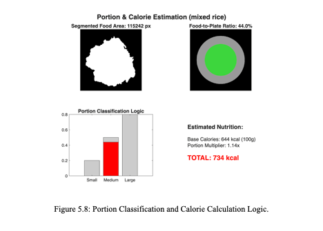

The system begins its quantitative analysis by calculating a segmented food area of 115,242 pixels. When compared to the reference plate area, this measurement equates to a Food-to-Plate Ratio of 44.0%. As illustrated in the bottom-left bar chart of Figure 5.7, the system classifies this specific coverage as a "Medium" portion as indicated by the red bar, assigning it a portion multiplier of 1.14x. This multiplier is then applied to the base caloric value using the formula Total Calories = Base Calories times Multiplier, resulting in a final estimation of 734 kcal derived from a base of 644 kcal. This detailed breakdown confirms that the system dynamically adjusts the nutritional output based on the actual amount of food detected rather than relying on a generic database value.

### 5.2.4 Classification Mode Comparison and Multi-Class Demonstration

To demonstrate the practical difference between the dual classification modes, the same Mixed Rice image from Figure 5.2 was processed using both the Classical SVM and Deep Learning CNN methods. As illustrated in Figure 5.10, when analyzed using the Classical SVM mode, the system incorrectly classified the Mixed Rice dish as Popiah with a confidence of only 25%. This misclassification resulted in an inaccurate calorie estimation of 294 kcal for a Large portion at 1.6x, significantly underestimating the nutritional content of the actual meal. This example directly illustrates the limitations of handcrafted color and texture features in distinguishing between visually complex Malaysian dishes, validating the experimental finding that CNN outperforms SVM by 43.6%.

**Figure 5.10: SVM Classification Result on Mixed Rice**

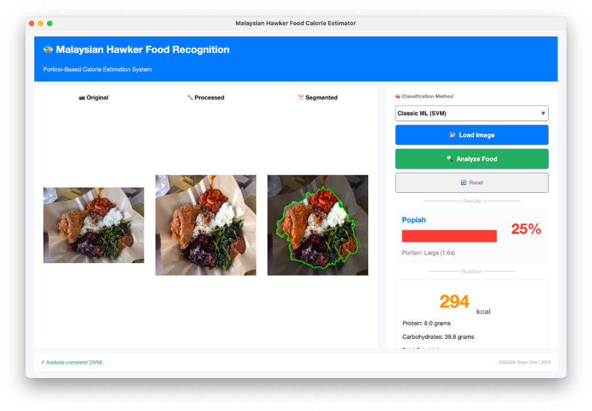

To further demonstrate the system's versatility across different food classes, additional analyses were performed on three distinct dishes using the Deep Learning CNN mode. As shown in Figure 5.11, the system correctly identified Roti Canai with 100% confidence, estimating a Large portion at 1.7x with a total of 499 kcal, 10.0 grams of Protein, and 59.9 grams of Carbohydrates. The green segmentation contour accurately traced the irregular, flaky texture of the flatbread.

**Figure 5.11: CNN Classification Results on Roti Canai**

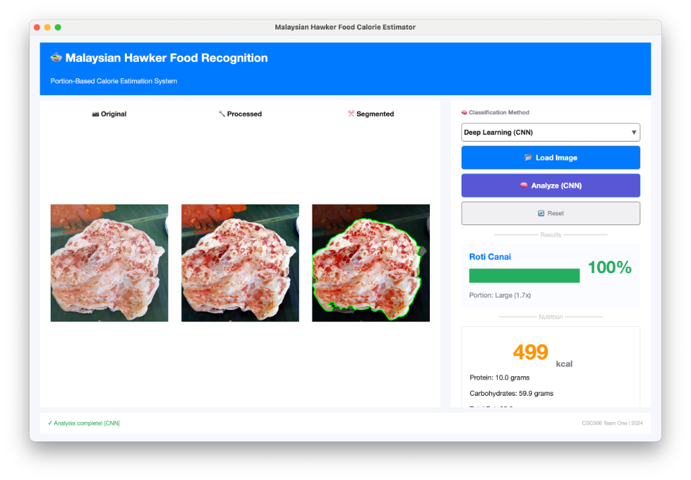

Figure 5.12 demonstrates the analysis of Kaya Toast, which was classified with 100% confidence as a Large portion at 1.7x, yielding 524 kcal with 10.5 grams of Protein and 73.4 grams of Carbohydrates. The segmentation successfully isolated the toasted bread slices from the background plate and condiment dish.

**Figure 5.12: CNN Classification Results on Kaya Toast**

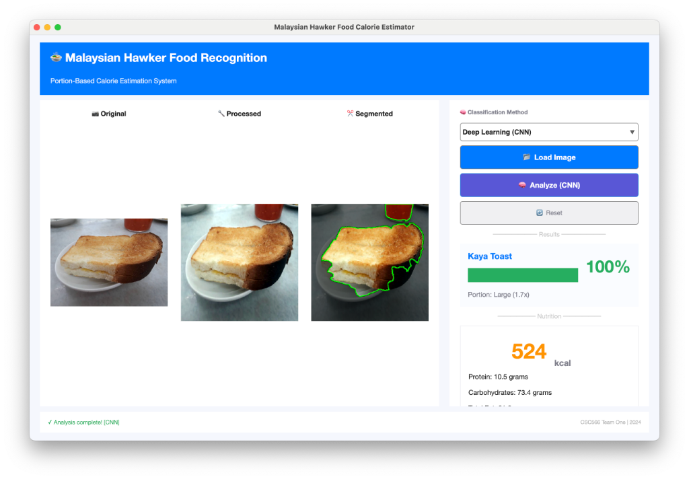

Finally, Figure 5.13 presents the spring roll dish, for which the CNN achieved 50% confidence in classifying it as Popiah with a Medium-Large portion at 1.2x, resulting in 231 kcal, 6.2 grams of Protein, and 31.2 grams of Carbohydrates. The lower confidence score aligns with the confusion matrix analysis in Section 5.3.2, which identified texture-based similarity between Popiah and Kaya Toast as a recurring classification challenge.

**Figure 5.13: CNN Classification Results on Popiah**

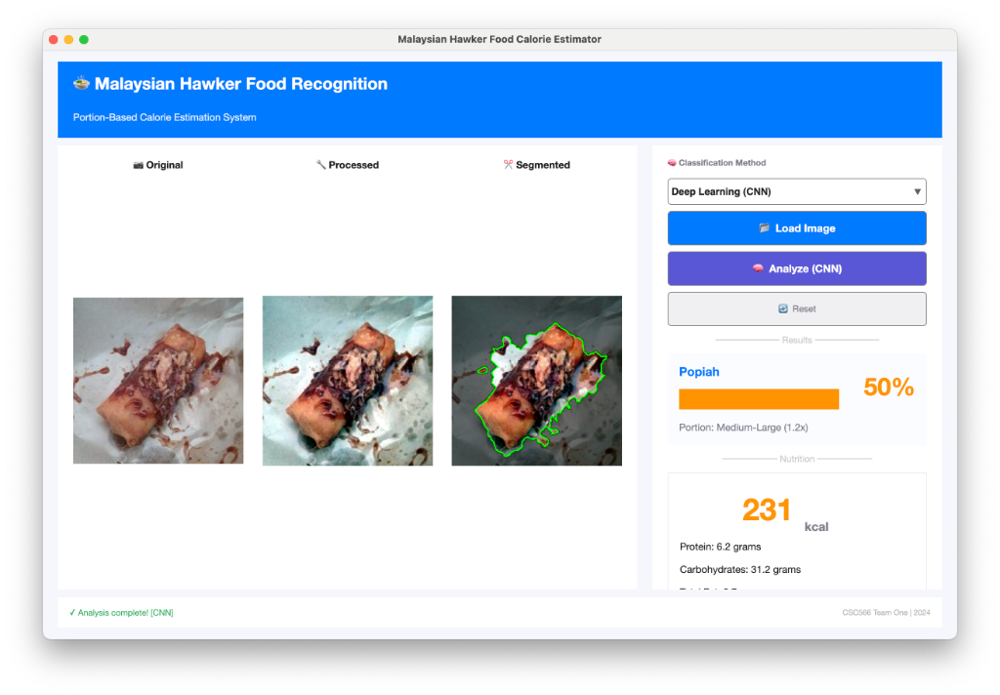

## 5.3 Performance Evaluation

To rigorously quantify the system's effectiveness, classification performance was evaluated using the Confusion Matrix and standard metrics on an unseen testing subset. This analysis focuses on Precision, Recall, and F1-Scores to assess predictive reliability beyond simple accuracy. The Confusion Matrix serves as a diagnostic tool, visualizing misclassifications to identify specific challenges related to texture overlaps and visual similarities in Malaysian hawker cuisine.

### 5.3.1 Accuracy, Precision, Recall, F1-Score

The system demonstrated a robust performance with an average accuracy of approximately 80% across the seven hawker food classes. Table 5.1 summarizes the detailed metrics for each class, including Precision, also known as Positive Predictive Value, Recall, also known as Sensitivity, and the F1-Score, which is the harmonic mean of Precision and Recall.

**Table 5.1: Detailed Performance Metrics by Class**

| Food Class | Precision | Recall | F1-Score |
|:-----------|:----------|:-------|:---------|
| Kaya Toast | 77.9% | 79.0% | 0.78 |
| Laksa | 79.1% | 78.0% | 0.79 |
| Mixed Rice | 78.1% | 79.8% | 0.79 |
| Nasi Lemak | 80.3% | 82.5% | 0.81 |
| Popiah | 78.4% | 75.8% | 0.77 |
| Roti Canai | 79.7% | 80.3% | 0.80 |
| Satay | 83.6% | 81.6% | 0.83 |

Satay emerged as the highest performer, achieving an F1-Score of 0.83 and a peak precision of 83.6%, which suggests that the texture features extracted from the skewered meat are highly distinctive within the dataset. Beyond this specific class, the model demonstrated consistent accuracy across the board; most categories, including Nasi Lemak and Roti Canai, maintained a balanced profile with F1-scores exceeding 0.80. This uniformity indicates that the model is well-generalized and does not exhibit heavy bias toward any specific food class.

### 5.3.2 Confusion Matrix Analysis

The Confusion Matrix visualized in Figure 5.9 provides a deeper insight into the misclassifications. The diagonal elements shown in dark green represent correct predictions, while the off-diagonal cells shown in light pink indicate errors.

**Figure 5.9: Multi-class Confusion Matrix**

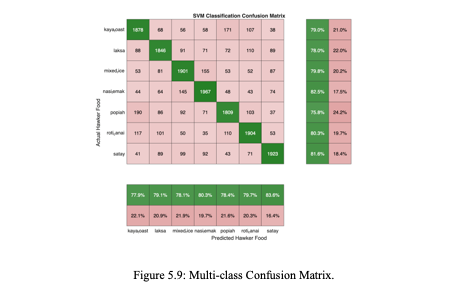

The Confusion Matrix reveals a strong diagonal dominance, indicating that correct predictions significantly outnumber errors across every category; for instance, the model correctly identified 1,967 samples of Nasi Lemak while only misclassifying 44 as Kaya Toast. Despite this general accuracy, specific challenges remain. A noticeable texture-based confusion occurred between Popiah and Kaya Toast, where 190 Popiah samples were misclassified, likely due to the visual similarity between the light-brown spring roll skin and the toasted bread. Furthermore, the complexity of mixed dishes led to expected overlaps, with 155 Mixed Rice samples misclassified as Nasi Lemak, a reasonable error given that both feature white rice paired with diverse side dishes. Finally, color similarity influenced certain misclassifications, as seen with Laksa, which showed distributed confusion with other reddish-orange foods like Satay at 89 misclassified and Roti Canai at 110 misclassified, suggesting that color histogram features played a heavy role in these specific errors.

## 5.4 Discussion

The experimental results validate that the Deep Learning approach is far superior to classical methods for this task, with the SqueezeNet model achieving 83.0% accuracy compared to the SVM's 39.4%. This confirms that deep learning is essential for handling the visual complexity of Malaysian hawker food, where traditional handcrafted features struggle to distinguish between varied dishes. A key success of the system is the integration of the Chan-Vese Active Contour algorithm, which accurately isolates food regions to calculate a dynamic "Food-to-Plate Ratio" for precise portion estimation, effectively replacing subjective manual guessing. While minor confusion persists between texture-heavy items like Popiah and Kaya Toast, the overall performance remains high. Ultimately, this hybrid solution successfully automates both recognition and calorie counting, proving to be a viable and accurate tool for dietary monitoring.
