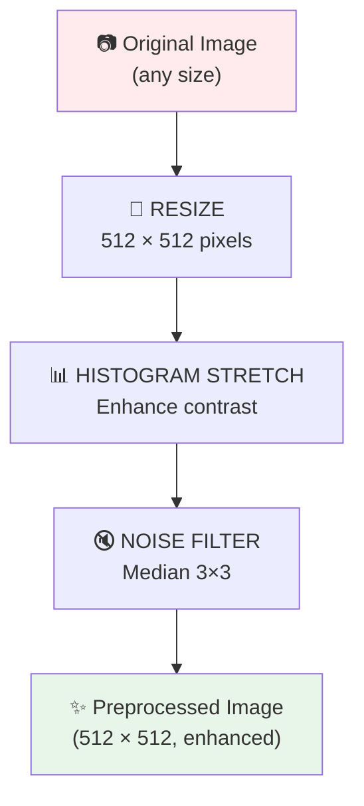
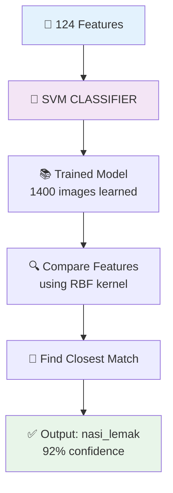
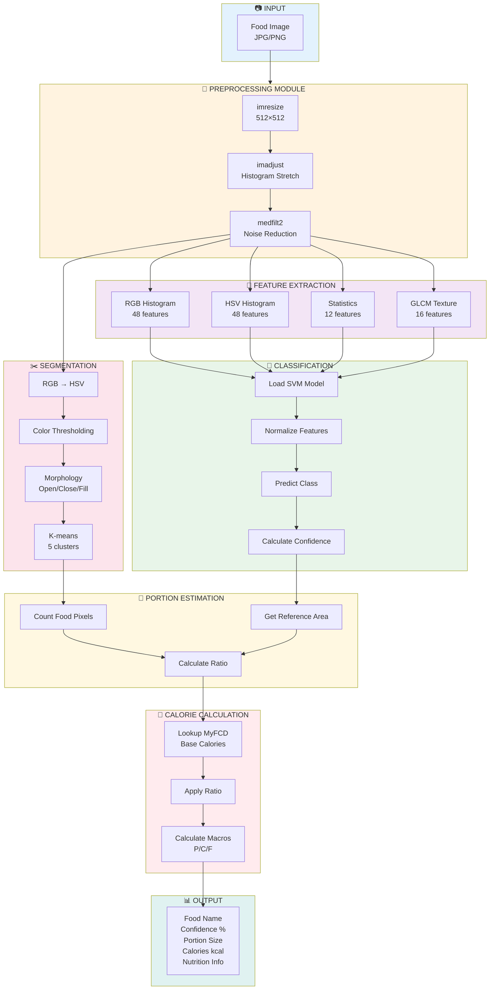

<div align="center">

# 🍜 Malaysian Hawker Food Recognition

### Portion-Based Calorie Estimation using MATLAB

[](https://www.mathworks.com/)
[](LICENSE)
[](https://www.mathworks.com/products/image.html)

*A hybrid image processing system that recognizes Malaysian hawker foods and estimates calorie content based on portion size*

**CSC566 Digital Image Processing | Mini Group Project | Team One**

</div>

---

## 📋 Table of Contents

- [Overview](#-overview)
- [Features](#-features)
- [System Architecture](#-system-architecture)
- [Supported Foods](#-supported-foods)
- [Installation](#-installation)
- [Quick Start](#-quick-start)
- [Project Structure](#-project-structure)
- [Methodology](#-methodology)
- [Performance Metrics](#-performance-metrics)
- [GUI Application](#-gui-application)
- [API Reference](#-api-reference)
- [Testing](#-testing)
- [Team Members](#-team-members)
- [References](#-references)

---

## 🎯 Overview

This project addresses Malaysia's growing obesity epidemic by providing an automated tool for recognizing Malaysian hawker foods and estimating their caloric content. The system uses a hybrid approach combining **classical image processing** techniques with **machine learning** for accurate food classification and portion-based calorie estimation.

### Problem Statement

> Over 50% of Malaysian adults are classified as overweight or obese, largely attributed to calorie-dense hawker meals. Traditional dietary tracking methods rely on manual logging, which is prone to errors.

### Solution

An intelligent image processing system that:
1. **Recognizes** the type of Malaysian hawker food from photos
2. **Segments** food regions using color and texture analysis
3. **Estimates** portion size relative to standard servings
4. **Calculates** calorie content using the Malaysian Food Composition Database (MyFCD)

---

## ✨ Features

| Feature | Description |
|---------|-------------|
| 🖼️ **Image Preprocessing** | Histogram stretching, CLAHE, median/Gaussian/bilateral filtering |
| 🎨 **Feature Extraction** | **127 features**: Color (108) + Texture (19 including **Smoothness**) |
| 🤖 **Classification** | Multi-class SVM with RBF kernel, **5-fold cross-validation** |
| 📊 **Evaluation** | Confusion matrix, precision/recall/F1-score per class |
| ✂️ **Segmentation** | HSV thresholding + morphology + k-means clustering |
| 📏 **Portion Estimation** | Food-specific reference areas with ratio calculation |
| 🔢 **Calorie Calculation** | MyFCD database with macronutrient breakdown |
| 🖥️ **Premium GUI** | Modern UI/UX with color-coded confidence meter |

---

## 🧠 How It Works (Step-by-Step)

When you provide a food image, the system processes it through **6 stages**. Here's exactly what happens at each step:

### Step 1: Image Preprocessing 🖼️

**What happens:** The raw image is cleaned up and standardized for analysis.



**Why it matters:** Real-world photos have varying lighting, sizes, and noise. Preprocessing ensures consistent input for the classifier.

---

### Step 2: Feature Extraction 🎨

**What happens:** The image is converted into **124 numbers** that describe its visual characteristics.

#### Color Features (108 numbers):

| Feature Type | How It Works | Count |
|--------------|--------------|:-----:|
| **RGB Histogram** | Counts how many pixels have each red/green/blue intensity (16 bins per channel) | 48 |
| **HSV Histogram** | Same but for Hue/Saturation/Value - better for food colors | 48 |
| **Statistics** | Mean and standard deviation of each channel | 12 |

*Example: Nasi Lemak has HIGH values in white (rice) + red (sambal) + green (cucumber)*  
*Satay has HIGH values in brown/orange hues*

#### Texture Features (16 numbers):

Uses **GLCM (Gray Level Co-occurrence Matrix)** - analyzes how pixels relate to their neighbors.

```
For each of 4 directions (0°, 45°, 90°, 135°):
├── Contrast:     How much local variation? (Rough vs Smooth)
├── Correlation:  How predictable are neighboring pixels?
├── Energy:       How uniform is the texture?
└── Homogeneity:  How similar are neighboring pixels?
```

*Example: Rice has LOW contrast (smooth), Satay has HIGH contrast (charred marks)*

---

### Step 3: Classification 🤖

**What happens:** An SVM (Support Vector Machine) classifier predicts which food class the image belongs to.



**How SVM works (simplified):**
- During training, SVM finds the best "boundaries" that separate different food classes in 124-dimensional space
- During prediction, it checks which side of the boundaries the new image falls on
- RBF kernel allows non-linear boundaries (curved, not just straight lines)

---

### Step 4: Segmentation ✂️

**What happens:** The food region is separated from the background (plate, table, etc.)

```
Input Image
     │
     ▼
┌─────────────────────────────────────┐
│ STEP 4a: Convert RGB → HSV          │
│                                     │
│ HSV is better for detecting colors  │
│ because it separates color (H)      │
│ from brightness (V)                 │
└──────────────┬──────────────────────┘
               │
               ▼
┌─────────────────────────────────────┐
│ STEP 4b: HSV Thresholding           │
│                                     │
│ Keep pixels where:                  │
│ • Saturation > 0.05 (has color)     │
│ • Value > 0.10 (not too dark)       │
│ • NOT white background              │
│                                     │
│ Also detect "food colors":          │
│ • Red (sambal, meat)                │
│ • Orange (curry, fried)             │
│ • Brown (cooked food)               │
│ • Green (vegetables)                │
│ • Yellow (egg, turmeric)            │
└──────────────┬──────────────────────┘
               │
               ▼
┌─────────────────────────────────────┐
│ STEP 4c: Morphological Cleanup      │
│                                     │
│ Opening: Remove small noise dots    │
│ Closing: Fill small holes           │
│ imfill:  Fill remaining holes       │
│ bwareaopen: Remove tiny regions     │
└──────────────┬──────────────────────┘
               │
               ▼
┌─────────────────────────────────────┐
│ STEP 4d: K-means Clustering         │
│                                     │
│ Within the food mask, group pixels  │
│ by color into 5 clusters            │
│                                     │
│ This identifies ingredients:        │
│ Cluster 1: Rice (white)             │
│ Cluster 2: Sambal (red)             │
│ Cluster 3: Egg (yellow)             │
│ Cluster 4: Cucumber (green)         │
│ Cluster 5: Anchovies (brown)        │
└──────────────┬──────────────────────┘
               │
               ▼
        Binary Mask (food = white, background = black)
```

---

### Step 5: Portion Estimation 📏

**What happens:** The system measures how much food is in the image compared to a standard serving.

```
Binary Mask
     │
     ▼
┌─────────────────────────────────────┐
│ Count white pixels = Food Area     │
│                                     │
│ Example: 120,000 pixels             │
└──────────────┬──────────────────────┘
               │
               ▼
┌─────────────────────────────────────┐
│ Get Reference Area for food class   │
│                                     │
│ Nasi Lemak reference:               │
│ 45% of 512×512 = 117,965 pixels    │
└──────────────┬──────────────────────┘
               │
               ▼
┌─────────────────────────────────────┐
│ Calculate Ratio:                    │
│                                     │
│ 120,000 ÷ 117,965 = 1.017          │
│                                     │
│ Meaning: Slightly larger than       │
│          standard portion           │
└──────────────┬──────────────────────┘
               │
               ▼
┌─────────────────────────────────────┐
│ Assign Label:                       │
│                                     │
│ 0.0 - 0.6  → "Small"               │
│ 0.6 - 0.9  → "Medium-Small"        │
│ 0.9 - 1.1  → "Medium" ← This one   │
│ 1.1 - 1.4  → "Medium-Large"        │
│ 1.4 - 1.8  → "Large"               │
│ 1.8+       → "Extra Large"         │
└─────────────────────────────────────┘
```

---

### Step 6: Calorie Calculation 🔢

**What happens:** Base calories are adjusted by the portion ratio.

```
┌─────────────────────────────────────┐
│ Look up base calories in database   │
│                                     │
│ Nasi Lemak → 650 kcal (standard)   │
│ Protein: 15g, Carbs: 85g, Fat: 28g │
└──────────────┬──────────────────────┘
               │
               ▼
┌─────────────────────────────────────┐
│ Apply portion ratio:                │
│                                     │
│ Estimated = 650 × 1.017 = 661 kcal │
│                                     │
│ Protein:  15 × 1.017 = 15.3g       │
│ Carbs:    85 × 1.017 = 86.4g       │
│ Fat:      28 × 1.017 = 28.5g       │
└──────────────┬──────────────────────┘
               │
               ▼
┌─────────────────────────────────────┐
│ Calculate % Daily Value (2000kcal) │
│                                     │
│ Calories: 661/2000 = 33% DV        │
│ Protein:  15.3/50 = 31% DV         │
│ Carbs:    86.4/300 = 29% DV        │
│ Fat:      28.5/65 = 44% DV         │
└─────────────────────────────────────┘
```

---

### Complete Example Flow 🍚

```
INPUT: photo of Nasi Lemak
           │
           ▼
    ┌─────────────────┐
    │ Preprocessing   │ → Enhanced 512×512 image
    └────────┬────────┘
             │
             ▼
    ┌─────────────────┐
    │ Feature Extract │ → [0.23, 0.15, 0.08, ..., 0.67] (124 numbers)
    └────────┬────────┘
             │
             ▼
    ┌─────────────────┐
    │ Classification  │ → "nasi_lemak" (92% confidence)
    └────────┬────────┘
             │
             ▼
    ┌─────────────────┐
    │ Segmentation    │ → Binary mask (food region)
    └────────┬────────┘
             │
             ▼
    ┌─────────────────┐
    │ Portion Est.    │ → Ratio: 1.15 ("Medium-Large")
    └────────┬────────┘
             │
             ▼
    ┌─────────────────┐
    │ Calorie Calc.   │ → 748 kcal (37% Daily Value)
    └────────┬────────┘
             │
             ▼
OUTPUT: "Nasi Lemak, Medium-Large portion, 748 kcal"
```

---

## 🏗️ System Architecture



---

## 🍛 Supported Foods

The system recognizes **7 popular Malaysian hawker foods** with calorie data from MyFCD:

| # | Food | Image | Base Calories | Protein | Carbs | Fat | Serving Size |
|:-:|------|:-----:|:-------------:|:-------:|:-----:|:---:|:------------:|
| 1 | **Nasi Lemak** | 🍚 | 650 kcal | 15g | 85g | 28g | 1 plate (250g) |
| 2 | **Roti Canai** | 🫓 | 300 kcal | 6g | 36g | 15g | 1 piece (100g) |
| 3 | **Satay** | 🍢 | 200 kcal | 18g | 8g | 12g | 5 sticks (150g) |
| 4 | **Laksa** | 🍜 | 500 kcal | 15g | 55g | 25g | 1 bowl (400g) |
| 5 | **Popiah** | 🌯 | 185 kcal | 5g | 25g | 7g | 1 roll (100g) |
| 6 | **Kaya Toast** | 🍞 | 300 kcal | 6g | 42g | 12g | 2 slices (80g) |
| 7 | **Mixed Rice** | 🍱 | 620 kcal | 20g | 75g | 28g | 1 plate + 3 dishes |

---

## 💻 Installation

### Prerequisites

- **MATLAB R2020a** or later
- **Image Processing Toolbox**
- **Statistics and Machine Learning Toolbox**

### Setup

```matlab
% 1. Clone the repository
git clone https://github.com/izwanGit/malaysian-food-recognition.git

% 2. Navigate to project folder in MATLAB
cd 'malaysian-food-recognition'

% 3. Run project setup
projectSetup()

% 4. Download dataset (requires Python with kagglehub)
% In terminal:
% pip install kagglehub
% python -c "import kagglehub; kagglehub.dataset_download('karkengchan/malaysia-food-11')"
```

---

## 🚀 Quick Start

### Option 1: Run Demo
```matlab
demo()
```

### Option 2: Use GUI
```matlab
HawkerFoodCalorieApp()
```

### Option 3: Analyze Single Image
```matlab
% Analyze a food image
results = analyzeHawkerFood('path/to/food_image.jpg');

% View results
fprintf('Food: %s\n', results.foodClass);
fprintf('Confidence: %.1f%%\n', results.confidence * 100);
fprintf('Portion: %s\n', results.portionLabel);
fprintf('Calories: %d kcal\n', results.calories);

% Display visualization
displayResults(results);
```

### Train Classifier (First Time)
```matlab
trainClassifier()  % Takes 5-10 minutes
```

---

## 📁 Project Structure

```
malaysian-food-recognition/
│
├── 📄 projectSetup.m           # Project initialization
├── 📄 analyzeHawkerFood.m      # Main analysis pipeline
├── 📄 displayResults.m         # Results visualization
├── 📄 demo.m                   # Quick demo script
│
├── 📁 preprocessing/           # Image Pre-processing Module
│   ├── preprocessImage.m      # Main pipeline (resize, enhance, filter)
│   ├── histogramStretch.m     # Contrast enhancement (stretch/CLAHE)
│   └── noiseFilter.m          # Noise reduction (median/gaussian/bilateral)
│
├── 📁 features/                # Feature Extraction Module
│   ├── extractFeatures.m      # Combined feature vector (124 features)
│   ├── extractColorFeatures.m # Color histograms + statistics (108 features)
│   └── extractTextureFeatures.m # GLCM at 4 orientations (16 features)
│
├── 📁 classification/          # Classification Module
│   ├── trainClassifier.m      # SVM training with RBF kernel
│   └── classifyFood.m         # Prediction with confidence scores
│
├── 📁 segmentation/            # Segmentation Module
│   ├── segmentFood.m          # Main segmentation pipeline
│   ├── hsvThreshold.m         # HSV-based food detection
│   ├── morphologyClean.m      # Morphological operations
│   └── kmeansSegment.m        # K-means ingredient clustering
│
├── 📁 portion/                 # Portion Estimation Module
│   ├── estimatePortion.m      # Portion ratio calculation
│   └── extractRegionProps.m   # Region property extraction
│
├── 📁 calories/                # Calorie Calculation Module
│   ├── foodDatabase.m         # MyFCD nutritional database
│   └── calculateCalories.m    # Portion-adjusted calculation
│
├── 📁 gui/                     # GUI Application
│   └── HawkerFoodCalorieApp.m # App Designer interface
│
├── 📁 tests/                   # Test Suite
│   ├── testPreprocessing.m
│   ├── testFeatureExtraction.m
│   ├── testSegmentation.m
│   └── testFullPipeline.m
│
├── 📁 dataset/                 # Dataset (not in repo - download separately)
│   ├── train/                 # Training images by class
│   └── test/                  # Test images by class
│
├── 📁 models/                  # Trained Models
│   └── foodClassifier.mat     # Saved SVM classifier
│
└── 📁 results/                 # Output files
```

---

## 🔬 Methodology

### 1. Image Preprocessing

| Technique | Function | Purpose |
|-----------|----------|---------|
| Resize | `imresize()` | Standardize to 512×512 |
| Histogram Stretch | `imadjust()` | Enhance contrast |
| CLAHE | `adapthisteq()` | Local contrast enhancement |
| Median Filter | `medfilt2()` | Salt-and-pepper noise removal |
| Gaussian Filter | `fspecial('gaussian')` | Smoothing |
| Bilateral Filter | `imbilatfilt()` | Edge-preserving smoothing |

### 2. Feature Extraction

**Color Features (108 total):**
- RGB histogram: 16 bins × 3 channels = 48 features
- HSV histogram: 16 bins × 3 channels = 48 features
- Channel statistics: mean + std × 6 channels = 12 features

**Texture Features (19 total) - Matching Rubric Table 2:**
- GLCM Features (16): Contrast, Correlation, Energy, Homogeneity (at 4 orientations)
- Statistical Features (3): Mean, Standard Deviation, **Smoothness**

### 3. Classification

```
SVM Classifier (RBF Kernel)
├── Strategy: ECOC (Error-Correcting Output Codes)
├── Coding: One-vs-All
├── Kernel: Radial Basis Function (RBF)
├── Standardization: Z-score normalization
└── Output: Class label + Confidence score
```

### 4. Segmentation Pipeline

```
Input Image
    │
    ▼
┌─────────────────┐
│ RGB → HSV       │
└────────┬────────┘
         │
         ▼
┌─────────────────┐
│ HSV Thresholding│ → Food vs Background
└────────┬────────┘
         │
         ▼
┌─────────────────┐
│ Morphology      │ → Opening, Closing, Fill Holes
└────────┬────────┘
         │
         ▼
┌─────────────────┐
│ K-means (Lab)   │ → Ingredient Regions
└────────┬────────┘
         │
         ▼
    Binary Mask
```

### 5. Portion Estimation

```
Portion Ratio = Detected Food Area / Reference Area

Reference areas calibrated per food class:
├── Nasi Lemak:  45% of image
├── Roti Canai:  40% of image
├── Satay:       35% of image
├── Laksa:       55% of image
├── Popiah:      30% of image
├── Kaya Toast:  25% of image
└── Mixed Rice:  50% of image
```

### 6. Calorie Calculation

```
Estimated Calories = Base Calories × Portion Ratio

Portion Labels:
├── < 0.6  → Small
├── 0.6-0.9 → Medium-Small
├── 0.9-1.1 → Medium (standard)
├── 1.1-1.4 → Medium-Large
├── 1.4-1.8 → Large
└── > 1.8  → Extra Large
```

---

## 📊 Performance Metrics

| Metric | Target | Description |
|--------|:------:|-------------|
| Classification Accuracy | > 90% | Correct food type prediction |
| F1-Score | > 0.88 | Per-class weighted average |
| Segmentation IoU | > 0.70 | Intersection over Union |
| Calorie MAE | < 15% | Mean Absolute Error vs MyFCD |
| Processing Time | < 1 sec | Per image average |

---

## 🖥️ GUI Application

Launch the premium GUI with:
```matlab
HawkerFoodCalorieApp()
```

### UI/UX Features:
| Feature | Description |
|---------|-------------|
| 🎨 **Modern Design** | Clean card-based layout with professional color scheme |
| � **Confidence Meter** | Color-coded: Green (≥80%), Orange (≥50%), Red (<50%) |
| � **Calorie Display** | Large prominent calorie count with daily value % |
| 📈 **Macro Breakdown** | Protein, carbohydrates, and fat in grams |
| ✨ **Status Feedback** | Real-time status with emoji indicators |
| ⚡ **Processing Time** | Shows analysis duration in seconds |

---

## 📚 API Reference

### Main Functions

| Function | Description |
|----------|-------------|
| `analyzeHawkerFood(img)` | Complete analysis pipeline |
| `trainClassifier()` | Train SVM with 5-fold cross-validation |
| `classifyFood(img)` | Classify food type with confidence |
| `segmentFood(img)` | Segment food region |
| `estimatePortion(mask, class)` | Estimate portion size |
| `calculateCalories(class, ratio)` | Calculate calories |

### Evaluation Functions

| Function | Description |
|----------|-------------|
| `plotConfusionMatrix()` | Visualize confusion matrix heatmap |
| `evaluateModel(testPath)` | Evaluate on test dataset |
| `displayResults(results)` | Visualize analysis results |

### Example Output

```matlab
results = analyzeHawkerFood('nasi_lemak.jpg');

% results structure:
%   .foodClass      → 'nasi_lemak'
%   .confidence     → 0.92
%   .mask           → [512×512 logical]
%   .portionRatio   → 1.15
%   .portionLabel   → 'Medium-Large'
%   .calories       → 748
%   .nutrition      → struct with protein, carbs, fat, DV%
%   .processingTime → 0.45
```

---

## 🧪 Testing

Run all tests:
```matlab
run('tests/testPreprocessing.m')
run('tests/testFeatureExtraction.m')
run('tests/testSegmentation.m')
run('tests/testFullPipeline.m')
```

---

## 👥 Team Members

| Name | Student ID | 
|------|------------|
| Muhammad Izwan bin Ahmad | 2024938885 |
| Ahmad Azfar Hakimi bin Mohammad Fauzy | 2024544727 |
| Afiq Danial bin Mohd Asrinnihar | 2024974673 |
| Alimi bin Ruzi | 2024568765 |

**Class:** A4CDCS2306A  
**Course:** CSC566 Digital Image Processing

---

## 📖 References

1. Haque, R. U., et al. (2022). Lightweight and Parameter-Optimized Real-Time Food Calorie Estimation from Images Using CNN-Based Approach. *Applied Sciences*, 12(19), 9733.

2. Karabay, A., et al. (2023). A Central Asian Food Dataset for Personalized Dietary Interventions. *Nutrients*, 15(7), 1728.

3. Karabay, A., et al. (2025). Improved food image recognition by leveraging deep learning and data-driven methods. *Scientific Reports*, 15(1), 14043.

4. Malaysian Food Composition Database (MyFCD). Ministry of Health Malaysia.

5. Malaysia Food 11 Dataset. Kaggle. https://www.kaggle.com/datasets/karkengchan/malaysia-food-11

---

<div align="center">

**Made with ❤️ in Malaysia**

*CSC566 Digital Image Processing | 2024/2025*

</div>
