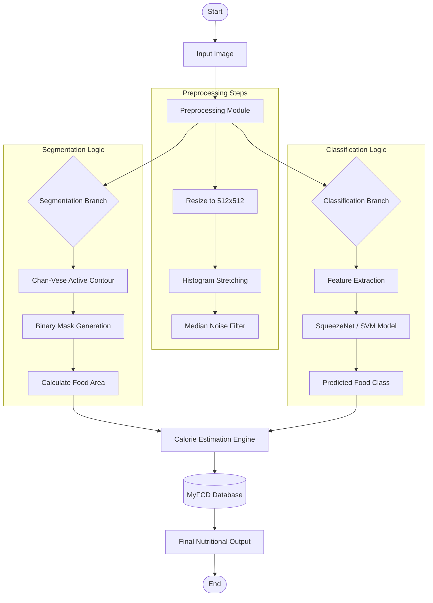

# CHAPTER 1: INTRODUCTION

This chapter provides a comprehensive overview of the proposed Malaysian Hawker Food Recognition and Calorie Estimation System. It begins by establishing the background of the project which highlights the necessity of automated dietary monitoring in the context of rising obesity rates. The specific objectives are then delineated to define the scope and technical goals of the development. Subsequently, the data collection methodology is detailed to explain the curation of the image dataset used for training the machine learning models. Finally, the overall system flowchart is presented to illustrate the complete operational pipeline from input processing to the final nutritional output.

## 1.1 Background of project

Obesity and diet-related non-communicable diseases have emerged as critical public health concerns in Malaysia. The high prevalence of these conditions is frequently attributed to the consumption of calorie-dense local dishes which are readily available at hawker centers. Detailed dietary monitoring is essential for managing personal health but remains a challenging task for the general public due to the difficulty in accurately estimating portion sizes and caloric content of diverse food items. Traditional methods of manual calorie counting are often tedious and prone to significant estimation errors which leads to poor adherence to dietary goals. This necessitates a technological solution that can automate the process of food recognition and nutritional assessment.

To address this issue, this project proposes an intelligent vision-based system capable of recognizing Malaysian hawker foods and ensuring accurate calorie estimation. The system leverages computer vision techniques to analyze food images captured by standard cameras. By integrating advanced image processing algorithms with machine learning models, the system seeks to provide users with immediate and reliable nutritional information. This approach not only simplifies the tracking of daily caloric intake but also empowers individuals to make informed dietary choices. The development of such a system represents a significant step towards leveraging artificial intelligence for preventative healthcare in the Malaysian context.

## 1.2 Objectives

The primary aim of this project is to develop a robust automated recognition system specifically for Malaysian hawker foods. This involves the curation of a representative dataset encompassing seven distinct food classes including Nasi Lemak, Roti Canai, Satay, Laksa, Popiah, Kaya Toast, and Mixed Rice. A core objective is to implement a high-precision segmentation module using the Chan-Vese Active Contour model. This advanced segmentation technique is chosen to enable accurate isolation of food regions from complex backgrounds which allows for more precise portion estimation compared to simple bounding box methods.

Another key objective is to evaluate and compare the performance of two distinct classification paradigms. The project aims to benchmark a Classical Computer Vision approach that utilizes handcrafted features such as Color Histograms and Gray-Level Co-occurrence Matrix texture descriptors against a modern Deep Learning approach using the SqueezeNet Convolutional Neural Network architecture. This comparison determines the most effective strategy for identifying visually similar food items. Furthermore, the project aims to integrate these components into a user-friendly Graphical User Interface developed in MATLAB. This interface is designed to display the recognition results, visual segmentation overlays, and calculated nutritional breakdowns directly from the Malaysian Food Composition Database.

## 1.3 Data Collection

The development of a reliable recognition system requires a diverse and high-quality dataset. For this project, a comprehensive image dataset was assembled comprising approximately 1200 original high-resolution images. These images were systematically collected from various sources including Google Images, Flickr, and direct photography to ensuring a wide variability in lighting conditions, plating styles, and camera angles. The dataset focuses on seven specific classes of Malaysian hawker food which are Nasi Lemak, Roti Canai, Satay, Laksa, Popiah, Kaya Toast, and Mixed Rice. These classes were selected based on their popularity and visual distinctiveness.

To enhance the generalizability of the trained models and prevent overfitting, data augmentation techniques were applied to the training set. Strategies such as random rotation within a range of plus or minus 20 degrees and horizontal flipping were rigorously employed to artificially expand the effective dataset size. This process ensures that the machine learning algorithms are exposed to a broader range of visual variations which improves their robustness when deployed in real-world scenarios. All images were preprocessed to a standardized resolution of 512 by 512 pixels to maintain consistency across the feature extraction and deep learning pipelines.

## 1.4 Flowchart

The overall system architecture follows a sequential processing pipeline that transforms a raw input image into actionable nutritional insights. This process begins with image acquisition and moves through preprocessing, segmentation, classification, and final calorie estimation. Figure 1.1 illustrates the detailed flow of the system.

*Figure 1.1: System Flowchart demonstrating the project pipeline from input to nutritional output.*

The process initiates with the **Preprocessing Module**, where the input image undergoes resizing to a uniform 512 by 512 resolution, followed by Histogram Stretching for contrast enhancement and Median Filtering for noise reduction. The flow then splits into two parallel branches. The **Segmentation Branch** employs the Chan-Vese Active Contour algorithm to generate a precise binary mask of the food item for area calculation. Simultaneously, the **Classification Branch** utilizes either the SqueezeNet model or SVM classifier to identify the food type. These two streams converge at the **Calorie Estimation Engine**, which queries the MyFCD Database using the predicted class and calculated area to derive the final calorie and nutrient values presented to the user.

