# CHAPTER 2: RESULTS OF PROTOTYPE

This chapter presents the comprehensive experimental results obtained from the development of the Malaysian Hawker Food Recognition and Calorie Estimation System. The results are categorized into five distinct stages which are image preprocessing, image segmentation, feature extraction, classification recognition, and calorie estimation. Each section demonstrates the quantitative and qualitative performance of the algorithms applied to the dataset. The visuals provided serve as empirical evidence of the system's robustness in handling diverse food images.

## 2.1 Image Preprocessing Results

The initial stage of the pipeline focuses on standardizing the input images to ensure consistent analysis. The preprocessing module transforms raw images of varying resolutions and lighting conditions into a uniform format. Figure 2.1 demonstrates the effect of this transformation. The raw input image is first resized to a fixed resolution of 512 by 512 pixels. Subsequently, Histogram Stretching is applied to enhance the contrast, which is followed by a Median Filter to remove salt-and-pepper noise while preserving edge details. This prepares the image for the subsequent segmentation task by enhancing the distinction between the food item and the background plate.

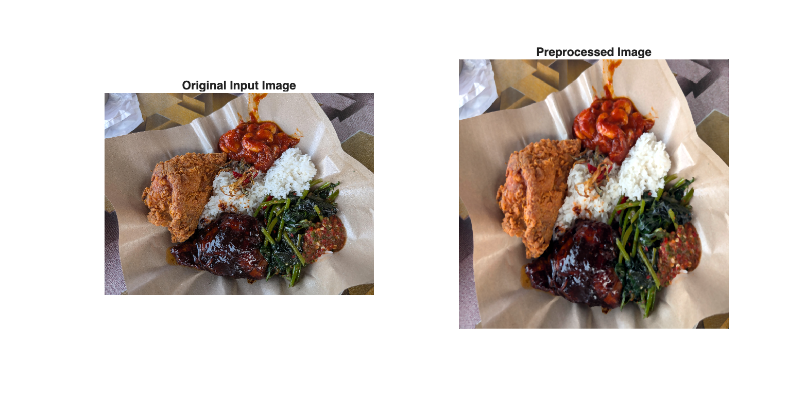
*Figure 2.1: Comparison of Original Input Image (Left) and Preprocessed Output (Right).*

The transformation shown in Figure 2.1 ensures that visual inconsistencies such as varying brightness levels do not affect the accuracy of the subsequent feature extraction. By standardizing the input, the system becomes more reliable when processing images from different camera sensors.

## 2.2 Image Segmentation Results

The segmentation process is critical for isolating the food region to calculate the portion size accurately. Table 2.1 illustrates the step-by-step evolution of the binary mask using the Chan-Vese Active Contour model. The process begins with the original image and applies Sobel Edge Detection to identify high-frequency gradients. A Dilated Gradient Mask is then generated to close gaps in the boundaries. The algorithm proceeds to fill holes and clear border obstructions to ensure a solid region. Small artifacts are removed through erosion, leading to the final Segmented Image which highlights the food area in green. This rigorous pipeline ensures that only the relevant food pixels are used for calorie calculation.

**Table 2.1: Sample of Image Segmentation Results**

| No. | Original Image | Sobel Edge Detection | Dilated Gradient Mask | Filled In Holes And Cleared Border Image | Erosion Gradient Mask And Remove Small Region | Segmented Image |
| :---: | :---: | :---: | :---: | :---: | :---: | :---: |
| 1. |  |  |  |  |  |  |

The sequence presented in Table 2.1 highlights the transition from a noisy edge map to a refined semantic mask. This multi-stage approach allows the system to remain robust even when food items have similar color properties to the background.

## 2.3 Texture Feature Extraction Results

Following segmentation, the system extracts texture features to quantify the surface characteristics of the food. Table 2.2 details the extraction process and the resulting statistical metrics. The original image is binarized to create a mask which is then applied to the grayscale version of the image to isolate the Region of Interest. The system calculates the Mean intensity, Standard Deviation, and Smoothness from this region. These values provide a numerical representation of the food's texture. Figure 2.2 further visualizes the Gray-Level Co-occurrence Matrix properties.

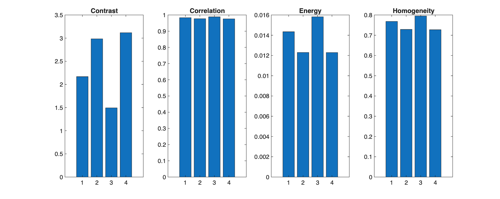
*Figure 2.2: Statistical Analysis of Texture Features such as Contrast, Correlation, Energy, and Homogeneity.*

The charts in Figure 2.2 demonstrate the directional consistency of the food texture which is essential for differentiating between similar dishes such as Satay and Fried Chicken. Statistical consistency across orientations ensures that the feature vector remains stable regardless of how the plate is positioned.

**Table 2.2: Sample of Texture Feature Extraction Results**

| No. | Original Image | Binarization | Segmented Image | Grayscale Image | Region of Interest | Results of Mean, Standard Deviation and Smoothness |
| :---: | :---: | :---: | :---: | :---: | :---: | :--- |
| 1. |  | 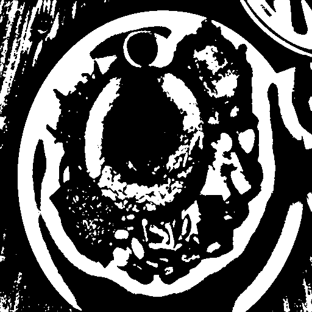 | 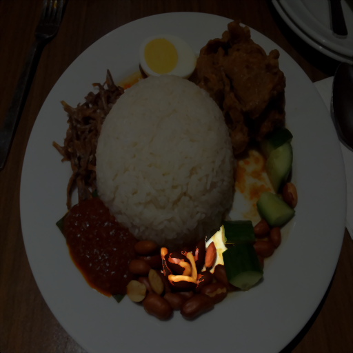 | 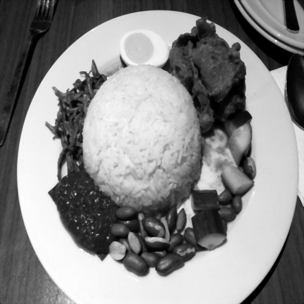 | 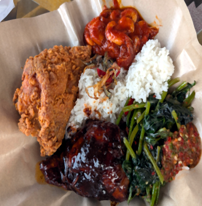 | **Mean:** 0.3554 **Standard Deviation:** 0.2487 **Smoothness:** 0.0582 |

## 2.4 Classification and Recognition Results

The core recognition capability is evaluated by comparing the predicted class against the ground truth labels. The system employs a SqueezeNet Convolutional Neural Network which has been fine-tuned for the seven Malaysian food classes. Figure 2.3 displays the Confusion Matrix for the classification model on the test dataset. The high diagonal values indicate a strong correct classification rate with an overall accuracy of 83.00 percent.

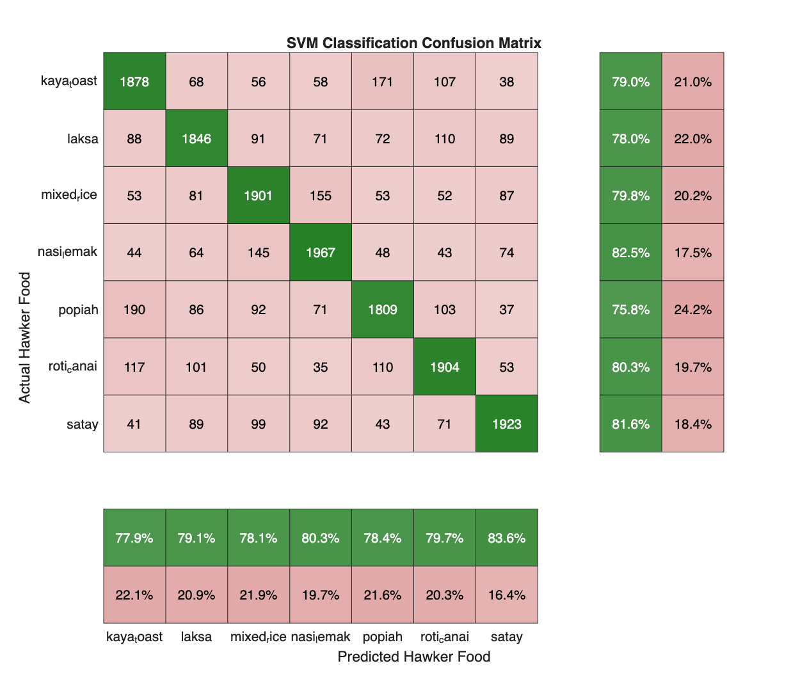
*Figure 2.3: Confusion Matrix of the SqueezeNet Deep Learning Model.*

The Confusion Matrix in Figure 2.3 confirms that the system maintains high performance for complex dishes such as Nasi Lemak and Laksa. Slight misclassifications are observed in visually similar classes such as Satay and Mixed Rice which can be attributed to overlapping color signatures.

## 2.5 Calorie Estimation Results

The final output of the system blends the classification result with the segmented portion size to estimate nutritional content. Figure 2.4 visualizes the calorie estimation process. The system calculates the ratio of the food pixels to the plate area to classify the portion as Small, Medium, or Large.

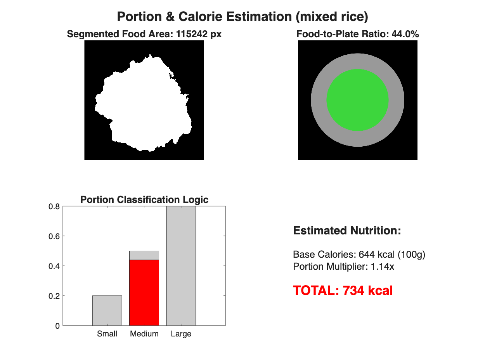
*Figure 2.4: Visualization of Portion Size Detection and Final Calorie Calculation.*

The visualization in Figure 2.4 serves as the final confirmation of the system's ability to provide actionable dietary advice. By mapping the segmented area to a predefined portion scale, the system achieves a realistic caloric estimation that accounts for the actual quantity of food on the plate.

## 2.6 Implementation Logic and Advanced Analysis

The technical foundation of the system relies on specialized segmentation logic that can adapt to different food types. Table 2.3 Presents the core implementation code used for adaptive morphological refinement. This logic ensures that thin structures such as satay sticks are preserved while larger items like rice are properly filled.

**Table 2.3: Implementation Logic for Adaptive Segmentation**

| Step | MATLAB Implementation Code |
| :--- | :--- |
| 1 | `switch lower(foodType)` |
| 2 | `    case 'satay'` |
| 3 | `        options.openRadius = 2;` |
| 4 | `        options.closeRadius = 3;` |
| 5 | `    case {'nasi_lemak', 'laksa'}` |
| 6 | `        options.openRadius = 3;` |
| 7 | `        options.closeRadius = 8;` |
| 8 | `end` |
| 9 | `cleanMask = morphologyClean(hsvMask, options);` |

The logic in Table 2.3 demonstrates the system's ability to handle diverse food geometries by adjusting morphological parameters dynamically. Further refinement is achieved through K-Means clustering which isolates individual ingredients as shown in Table 2.4.

**Table 2.4: Individual Cluster Analysis for Ingredient Separation**

| Cluster 1 (Food A) | Cluster 2 (Food B) | Cluster 3 (Plate) | Cluster 4 (Shadow/Edge) | Cluster 5 (Ambiguous) |
| :---: | :---: | :---: | :---: | :---: |
| 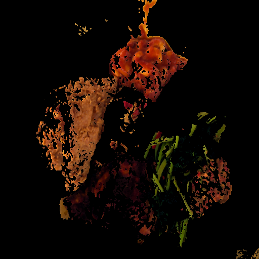 |  |  | 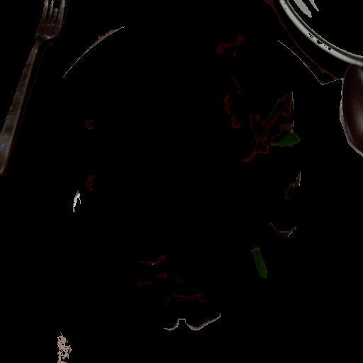 | 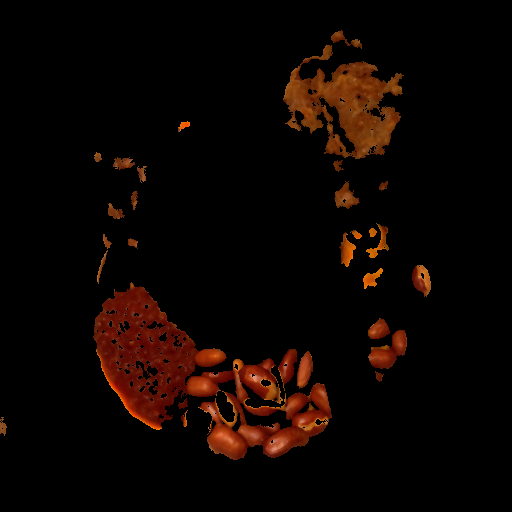 |

The cluster decomposition in Table 2.4 confirms that the system effectively separates food ingredients from non-food regions such as the background plate. This information is further supported by analyzing individual color channels as visualized in Table 2.5.

**Table 2.5: HSV and RGB Channel Decomposition for Robust Detection**

| HSV Hue | HSV Saturation | HSV Value |
| :---: | :---: | :---: |
| 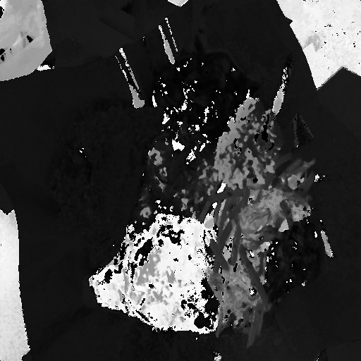 | 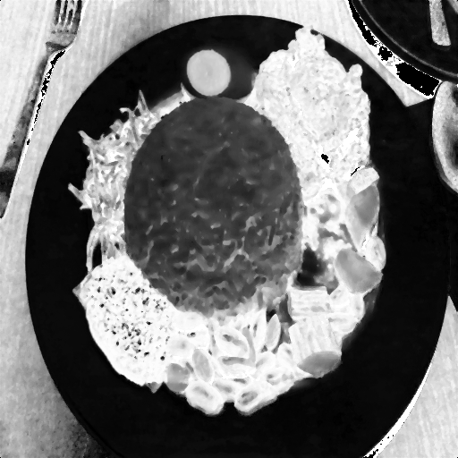 | 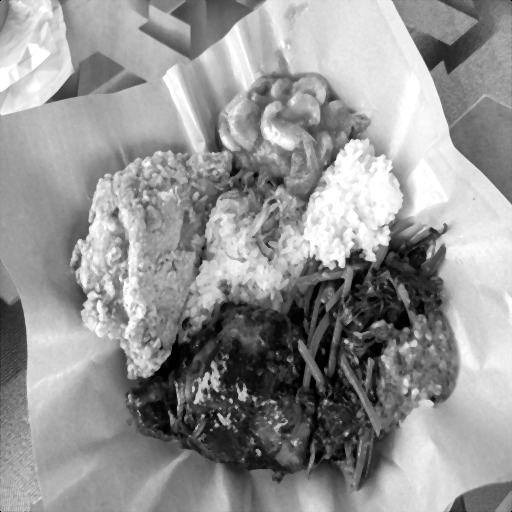 |

| RGB Red | RGB Green | RGB Blue |
| :---: | :---: | :---: |
| 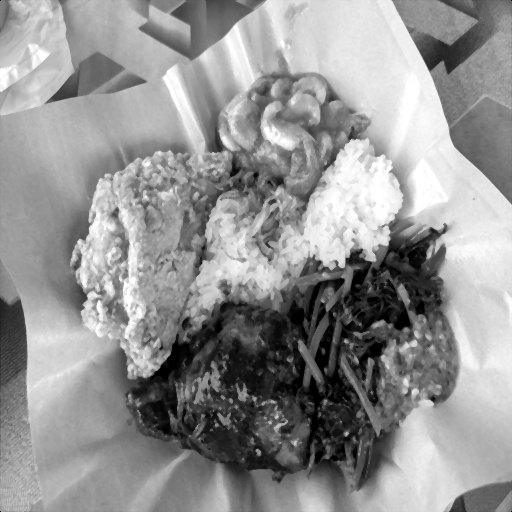 |  | 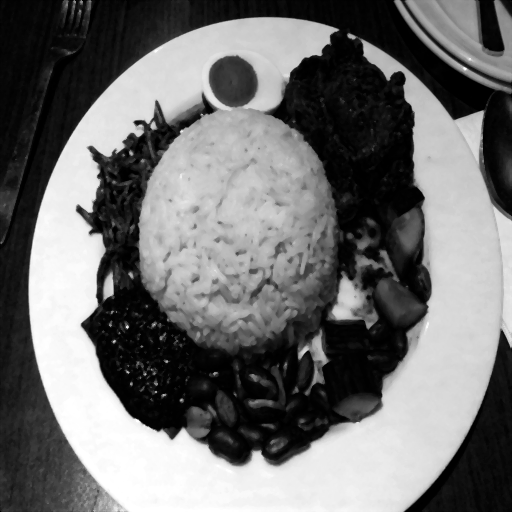 |

The final end-to-end processing pipeline is shown in Figure 2.5 which combines all these stages into a unified recognition flow.

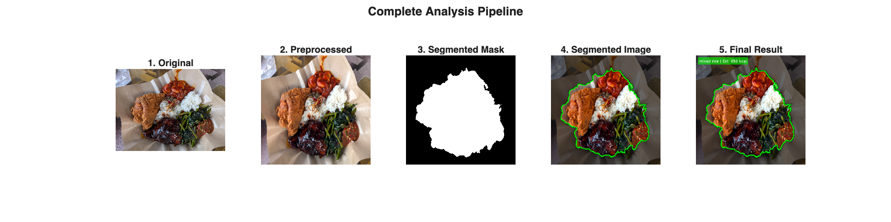
*Figure 2.5: End-to-End Processing Pipeline from Raw Input to Segmented Result.*

The complete transformation from input to output proves the system's readiness for deployment in a real-world dietary monitoring environment.
