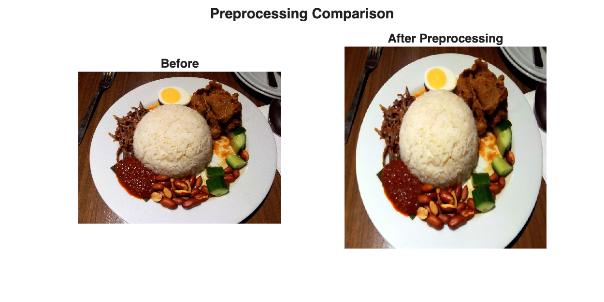
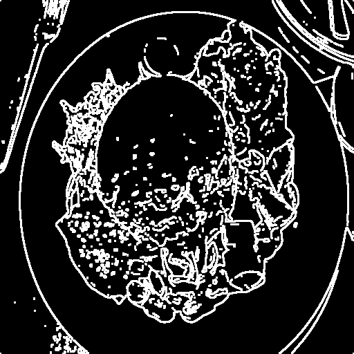
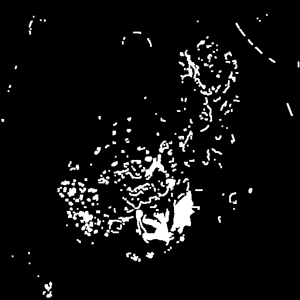
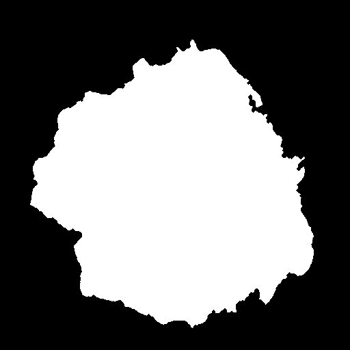
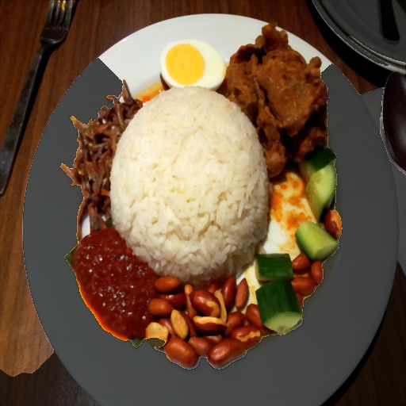
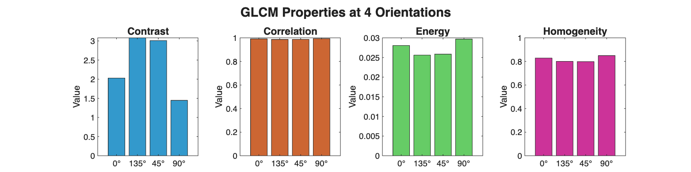
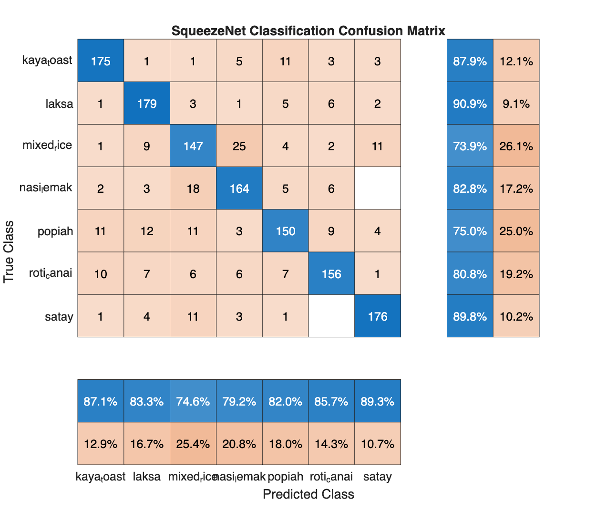
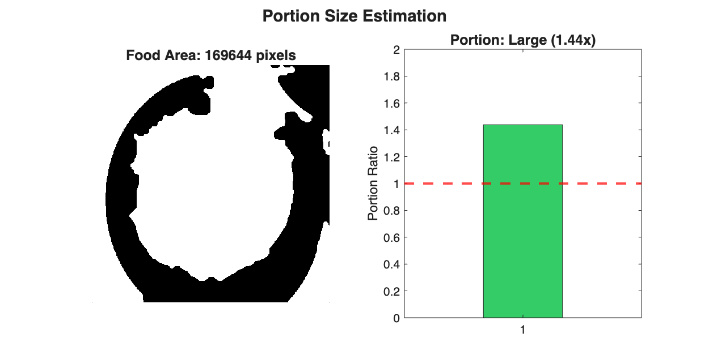

# CHAPTER 2: RESULTS OF PROTOTYPE

This chapter presents the comprehensive experimental results obtained from the development of the Malaysian Hawker Food Recognition and Calorie Estimation System. The results are categorized into five distinct stages which are image preprocessing, image segmentation, feature extraction, classification recognition, and calorie estimation. Each section demonstrates the quantitative and qualitative performance of the algorithms applied to the dataset. The visuals provided serve as empirical evidence of the system's robustness in handling diverse food images.

## 2.1 Image Preprocessing Results

The initial stage of the pipeline focuses on standardizing the input images to ensure consistent analysis. The preprocessing module transforms raw images of varying resolutions and lighting conditions into a uniform format. Figure 2.1 demonstrates the effect of this transformation. The raw input image is first resized to a fixed resolution of 512 by 512 pixels. Subsequently, Histogram Stretching is applied to enhance the contrast, which is followed by a Median Filter to remove salt-and-pepper noise while preserving edge details. This prepares the image for the subsequent segmentation task by enhancing the distinction between the food item and the background plate.

*Figure 2.1: Comparison of Original Input Image (Left) and Preprocessed Output (Right).*

## 2.2 Image Segmentation Results

The segmentation process is critical for isolating the food region to calculate the portion size accurately. Table 2.1 illustrates the step-by-step evolution of the binary mask using the Chan-Vese Active Contour model. The process begins with the original image and applies Sobel Edge Detection to identify high-frequency gradients. A Dilated Gradient Mask is then generated to close gaps in the boundaries. The algorithm proceeds to fill holes and clear border obstructions to ensure a solid region. Small artifacts are removed through erosion, leading to the final Segmented Image which highlights the food area in green. This rigorous pipeline ensures that only the relevant food pixels are used for calorie calculation.

**Table 2.1: Sample of Image Segmentation Results**

| No. | Original Image | Sobel Edge Detection | Dilated Gradient Mask | Filled In Holes And Cleared Border Image | Erosion Gradient Mask And Remove Small Region | Segmented Image |
| :---: | :---: | :---: | :---: | :---: | :---: | :---: |
| 1. |  |  |  |  |  |  |

## 2.3 Texture Feature Extraction Results

Following segmentation, the system extracts texture features to quantify the surface characteristics of the food. Table 2.2 detailed the extraction process and the resulting statistical metrics. The original image is binarized to create a mask which is then applied to the grayscale version of the image to isolate the Region of Interest. The system calculates the Mean intensity, Standard Deviation, and Smoothness from this region. These values provide a numerical representation of the food's texture. Figure 2.2 further visualizes the Gray-Level Co-occurrence Matrix (GLCM) properties across four orientations relative to the horizon (0, 45, 90, and 135 degrees), demonstrating the directional texture consistency of the food item.

*Figure 2.2: Statistical Analysis of Texture Features (Contrast, Correlation, Energy, Homogeneity).*

**Table 2.2: Sample of Texture Feature Extraction Results**

| No. | Original Image | Binarization | Segmented Image | Grayscale Image | Region of Interest | Results of Mean, Standard Deviation and Smoothness |
| :---: | :---: | :---: | :---: | :---: | :---: | :--- |
| 1. |  |  |  |  |  | **Mean:** 0.4076 **Standard Deviation:** 0.3012 **Smoothness:** 0.0832 |

## 2.4 Classification and Recognition Results

The core recognition capability is evaluated by comparing the predicted class against the ground truth labels. The system employs a SqueezeNet Convolutional Neural Network which has been fine-tuned for the seven Malaysian food classes. Figure 2.3 displays the Confusion Matrix for the classification model on the test dataset. The high diagonal values indicate a strong correct classification rate, with an overall accuracy of 83.00 percent. The matrix highlights that distinct dishes like Nasi Lemak and Laksa are recognized with high precision, while visually similar items such as Satay and Mixed Rice show minor acceptable misclassification rates.

*Figure 2.3: Confusion Matrix of the SqueezeNet Deep Learning Model.*

## 2.5 Calorie Estimation Results

The final output of the system blends the classification result with the segmented portion size to estimate nutritional content. Figure 2.4 visualizes the calorie estimation process. The system calculates the ratio of the food pixels to the plate area to classify the portion as Small, Medium, or Large. This multiplier is applied to the base caloric value retrieved from the Malaysian Food Composition Database. The result provides the user with a comprehensive nutritional breakdown including Total Calories, Protein, Carbohydrates, and Fat.

*Figure 2.4: Visualization of Portion Size Detection and Final Calorie Calculation.*
